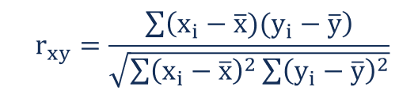

# Summary of this videos

   - **Lesson 31 (Normal Quantiles):-**
        - CI =  Mean +/- 1.96 * (sqrt(P(1-p) / sqrt(n))
          - sqrt(P(1-P)) = σ 
        - The magic number **1.96** come from Central Limit Theorem.
        - Increase our confidance, means larger value of Quantiles. 
        - Decrease our confidance, means smaller value of Quantiles.

   - **Lesson 32 (Hypothesis Test):-**
        - **Hypothesis Test**:-
            - is using in decision making.
            - is an act in statistics whereby an analyst tests an assumption regarding a population parameter.
        - Null Hypothesis H0:-
          - is usually a hypothesis of equality between population parameters.
          - a null hypothesis may state that the population mean return is equal to zero.  
          - is considered the basic hypothesis until it's proven that it's wrong.     
        - Alternate Hypothesis H1:-
          - is effectively the opposite of a null hypothesis.
          - the population mean return is not equal to zero.
          - Thus, they are mutually exclusive, and only one can be true. However, one of the two hypotheses will always be true.     
        - Critical value:-
          - is a line on a graph that splits the graph into sections.    
          - One or two of the sections is the “rejection region“;
            - if your test value falls into that region, then you reject the null hypothesis. 
          - is calculated from z-table. 

   - **Lesson 33 (Hypothesis Test 2):-**
        - CI =  Mean +/- 1.96 * sqrt(P(1-p) / n )
          - sqrt(P(1-P)) = σ
        - If H0 is inside the confidence interval CI:-
          - Every thing is OK :)
        - If H0 is not inside the confidence interval CI:-
          - Then H0 is rejected and accept H1. 
        - Given Data X1 ... Xn:-
          1. compute **mean**
          2. compute **variance
          3. compute **t-value**: t(N-1, p) = a
             - get a from z-table
          4. compute CI size = Mean +/- 1.96 * sqrt(P(1-p) / n )
        - Z-Table:-  
        
       
   - **Lesson 34 (Programming Tests and Intervals):-**
        - programming CI and Hypothesis Test.

   - **Lesson 35 (Inference):-**
        - **Margin of error**:-
           - tells you how many percentage points your results will differ from the real population value. 
           - Margin of error = CI width.
           - e = 1.96 * sqrt(P(1-p) / n )
             - if n is unknown, n = p * (1-p) * 1.96^2 / e^2
        - As the sample size approacges ∞, the confidance inerval CI width approaches 0.

   - **Lesson 36 (Regression):-**
        - **Linear Regression** tries to fit a line that best describes the data.
        - we aim to min error and find best parameters that fit the data.
        - LR equation Y = bX + a
          - we aim to fond the best a, b parameters that min error.
          - b = sum((Xi - mean(Xi) * (Yi - mean(Yi)) / sum(Xi - mean(Xi))^2.
          - a = mean(Y) - b * mean(X)

   - **Lesson 37 (Correlation):-**
        - **Correlation** occures When two sets of data are strongly linked together.
            - Correlation is Positive when the values increase together **r > 0**. 
            - Correlation is Negative when one value decreases as the other increases **r < 0**.
            - **r = 0** nor relationship, no correlation.
        - Correlation can have a value:-
          - **1** is a perfect positive correlation.
          - **0** is no correlation (the values don't seem linked at all).
          - **-1** is a perfect negative correlation. 
        - Correlation formula r:-
        

   - **Lesson 38 (Monty Hall Problem):-**
        - Monty Hall game 

   - **Lesson 39 (Regression and Correlation):-**
        - r does not change when scale data.
        - b does not change when scale data by the same amount.
        - Relationship between r and b:
          - b / r = sqrt(sum(Y-mean(Y))^2 / sum(X-mean(X))^2) 
          - sqrt(sum(Y-mean(Y))^2 / sum(X-mean(X))^2) = σy / σx  

   - **Lesson 40 (Weight Case Studies):-**
        - Exercise about:-
          - Get rid of outlires using quartiles.
          - Calculate the confidence interval **CI**
          - Calculate the satndard score **Z-Score**
          - Calculate correlation.
        - **Covariance** between two variables X and Y is:  
            - cov(X,Y) = 1/n * sum((X-mean(X)*(Y-mean(Y)))

        - **Correation r** = cov(X,Y) / stdev(X)*stdev(Y)
        - **b** = cov(X,Y) / var(X)
        - **a** = mean(Y) - b * mean(X)  
        - Steps dealing with data:-
          1. Inspected a data sample with two dimensions.
          2. Remove outlires using any method of thresholding.
          3. Calculate the basic statistics as mean, stdev, and covariance.
          4. Calaculate Correlation and Redgression 

   - **Lesson 41 (Flash Crash Example):-**
        - Just example about how to calculate CI from financial data.
        - ΔT = (Xt+1 - Xt) / Xt

   - **Lesson 42 (Challenger Example):-**
        - example on temperature and it's effect on flight
        - Calculate linear regression with terms a and b

   - **Lesson 43 (Final Exam):-** 

# What’s new for you ?

   - Normal Quantiles
   - Hypothesis Test

# Additional Resources ? 

   - https://www.khanacademy.org/math/statistics-probability/significance-tests-one-sample/more-significance-testing-videos/v/z-statistics-vs-t-statistics
   - https://www.investopedia.com/terms/h/hypothesistesting.asp#:~:text=Hypothesis%20testing%20is%20an%20act,hypothesis%20by%20using%20sample%20data.
   - https://www.youtube.com/watch?v=RDKPJpwN2ps
   - https://www.statisticshowto.com/probability-and-statistics/find-critical-values/
   - https://www.statisticshowto.com/rejection-region/
   - https://www.youtube.com/watchtime_continue=7&v=yk3soTy7Bko&feature=emb_logo
   - https://www.statisticshowto.com/probability-and-statistics/hypothesis-testing/margin-of-error/
   - https://www.mathsisfun.com/data/correlation.html
   - https://www.youtube.com/watch?v=mhlc7peGlGg
   - https://www.statisticshowto.com/probability-and-statistics/z-score/

