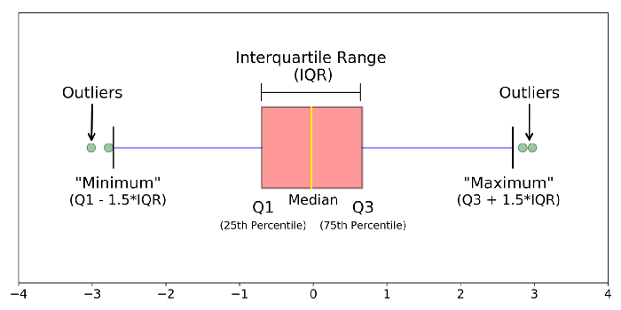

# Summary of this videos

   - **Lesson 1 (Orientation):-**
        - It is about research methods and visualizing data.
        - Sample is used to learn about the population.
        - Learn how to use Google spreedsheet.

   - **Lesson 2 (Orientation Problem Set):-**
        - Just review for udacity tools and google spreedsheet.

   - **Lesson 3 (Intro to statistical research methods):-**
        - **Constructs**:
            - It's something which cannot be directly measured.
            - Examples:-
              - Memory
              - Happiness
              - Anger (Number of profanities uttered per minute)
              - Guilt
              - Intelligence (IQ Test, Grades)
              - Effort (minutes doing HW, grades, GPA)
              - Age (maturity, age in years, wisdom)
              - Hunger (how often your tummy grumbles, how deficient your body is in nutrients)
              - Itchiness  
        - **Operational Definition**:
            - The descriptions for constructs that we settle on and that helps you measure constructs in real world.
        - **Lurking variable**:
            - Is a variable that is not included as an explanatory or response variable in the analysis.
            - Can affect the interpretation of relationships between variables. 
            - Can falsely identify a strong relationship between variables.
            - Can hide the true relationship.
            - To discover lurking variables:
              - Understand data and the important variables that can affect a process.    
        - The better the sample is, The more closer to the population.
        - Predictor variable is the independen variable.
        - Outcome variable is the dependent variable.
        - Correlation does not imply causation.
        - If you want to show **relationships** 
          - You need to observational studies surveys
        - If you want to show **causation**
          - You need to controlled experiment.  
        - **Double blind** study:
            - is a study in which both the person implementing the experiment and the participant(s) are not aware of which individual is receiving the experimental treatment.
            - This procedure is utilized to prevent bias in research results.

   - **Lesson 4 (Problem set 1):-**
        - 50 Questions about statistical research methods.

   - **Lesson 5 (Visualization Data):-**   
        - Some Basic of Probability
          - all probability sums to 1
          - all probability is between 0 and 1
          - We can use frequency to present and visualize our data
          - We can divide our data to intervals to visualize it usuing histogram.       
          - Difference between **Histogram** and **Bar graph**.

   - **Lesson 6 (Problem set 2):-**
        - questions about histogram, frequenct table, and basic probability.   
   
   - **Lesson 7 (google Spreadsheet):-**    
        - How to deal with google spreadsheet and doing basic statistical methods.  

   - **Lesson 8 (Central tendency):-** 
        - Distribution can be described by:-
          - **Mode**: The value at which frequency is highest
          - **Median**: Value in the middle
          - Average
        - **Mode**:-
          - single value with the hisghest frequency.
          - Range that occured with the highest frequency. 
          - Some distributions has no mode as uniform distribution.
          - Some othe distributions has multible mode as bi-modal distribution.
          - Mode can be categorical data which has the highest value.
          - The mode occurs on the X-axis, so you are looking for whatever value has the highest frequency. 
        - **Mean**:-
            - All scores in the distribution affect the mean.
            - The formula of the mean is **sum(Xi) / n**
            - Many samples from the same population will have similar means.
            - The mean of the sample can be used to make inference about the population it came from.
            - The mean will change if we add an extreme value to the dataset.
            - The mean(Average) can be misleading when we have outlires.
        - **Median**:-
            - is the "middle" of the data; meaning half of the data values are less than the median, and half are greater.
            - We have to put the data in order.
        - Measures of center 
          - Mean
          - Median: suitable when dealing with highly skewed distributions.
          - Mode    
 
   - **Lesson 9 (Problem set 3):-**  
        - Question about Centeral tendency 

   - **Lesson 10 (Variability)**
        - **Range**:
            - Is the difference between the maximum value and the minimum value observed.
            - range sometimes changes when we add new data to the dataset.
            - To deal with outlires values, we cut the upper and lower 25% of the data using quratiles.       
              1. split the data in half which is Q2
              2. find the median of first half Q1
              3. find the median of the second half Q3
              4. calculate the difference between Q1 and Q3 which is **Interquartile Range** IQR = Q3 - Q1
            - **IQR**:
                - About 50% of the data falls within the IQR.
                - The IQR isn't affected by every value in the dataset.
                - The IQR isn't affected by outlires.
        - **Outlires**:
            - we visualize quartiles and outlires with **box plot** 
            - 
        - We can measure **variability** using all data values by calculate the average distance between each data value and the mean.
        - Average Deviation:-
          - sum(Xi - mean) / n
          - To prevent the negative and positive deviations from canceling each other:-
            - Ignore the negative sign(absolute value)
              - sum(|Xi-mean|) / n  
            - Square each deviation  
              - sum(Xi - mean)^2 <-- Variance   
              - sum(area of each square)
        - **Standard Deviation**:
            - Is the most common measure of spread 
            - we get std by taking the square root of the variance.  
            -   
            - Bassel's Correction(Corrected STD) :-
              - STD = sqrt(sum(Xi-mean)^2 / n-1)
              - 

   - **Lesson 11 (Problem set 4:Variability)**
        - Questions about variability
 
   - **Lesson 12 (Lesson 1-4 Review)**
        - Review questions    

# What’s new for you ?

   - Constructs
   - Lurking variable
   - Variability

# Additional Resources ?  

   - https://medium.com/@jicksy.john/constructs-and-operational-definition-descriptive-statistics-84e7c752d17c
   - https://support.minitab.com/en-us/minitab-express/1/help-and-how-to/modeling-statistics/regression/supporting-topics/regression-models/what-is-a-lurking-variable/#:~:text=A%20lurking%20variable%20is%20a,can%20hide%20the%20true%20relationship.
   - https://education.seattlepi.com/examples-double-blinded-study-experiment-4352.html
   - https://www.verywellmind.com/what-is-a-double-blind-study-2795103
   - https://www.kqed.org/mindshift/26079/why-sleeping-may-be-more-important-than-studying
   - https://www.scribbr.com/methodology/sampling-methods/
   - https://corporatefinanceinstitute.com/resources/knowledge/other/negatively-skewed-distribution/#:~:text=In%20statistics%2C%20a%20negatively%20skewed,the%20distribution%20graph%20is%20longer.
   - https://statistics.laerd.com/statistical-guides/measures-central-tendency-mean-mode-median.php
   - https://docs.google.com/document/d/1ZGXA1LPK9hhW8ZCRv2KENpJBDvr9EoBOaIlXgYkubS4/edit
   - https://stattrek.com/descriptive-statistics/variability.aspx
   - https://www.mathsisfun.com/data/quartiles.html
   - https://towardsdatascience.com/understanding-boxplots-5e2df7bcbd51 

