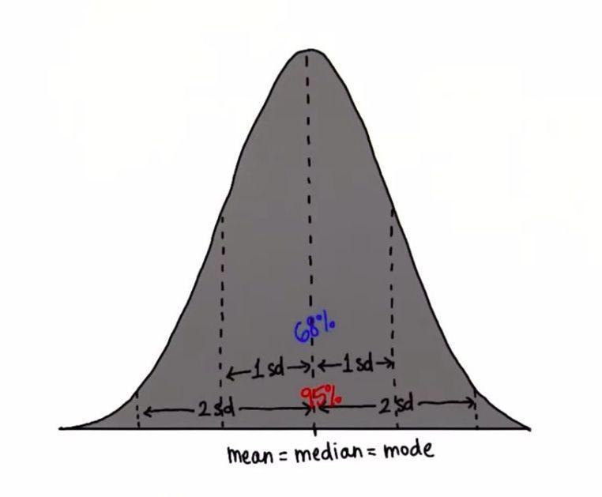
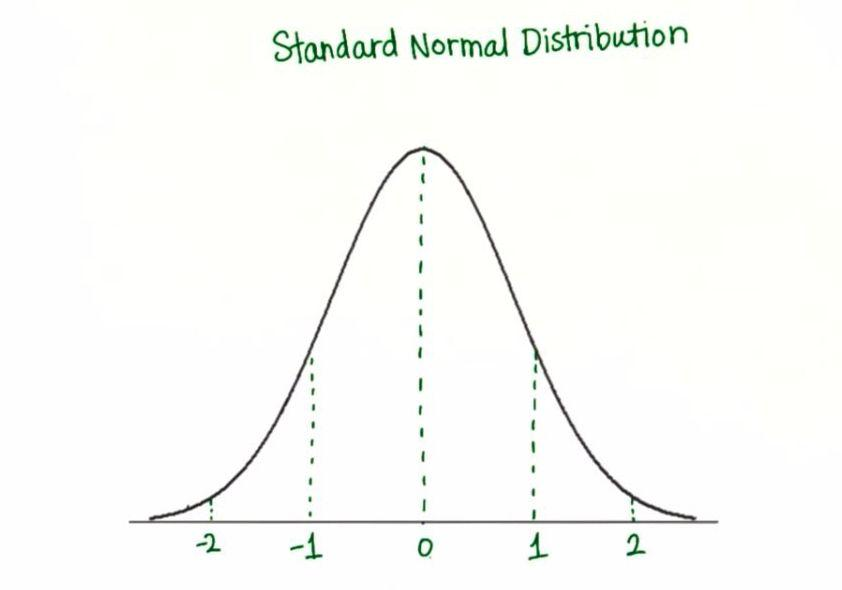
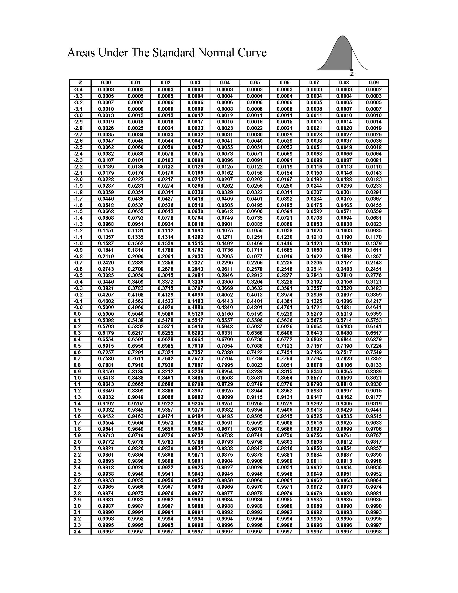

# Summary of this videos

   - **Lesson 13 (Standardizing)**
        - Histogram is used to describe the data.
          - In skewed distribution
            - Mean, median, and mode are different from each other.
            - Median might be more useful than the mean.
          - In normal distribution
            - Mean, median, and mode are approximately equal.
        - If we deacrese the bin size, we loose the shape of our distribution
        - To have more details, we should a smaller bin size
        - In histogram, when we have the proportions, they all add to **1**.
        - Likewise, the area under the curve, is equal to **1**.   
        - There are many kinds of noraml distributions as:
          - Stretched
          - Skinny
          - in the middle
        - Area underneath always be **1 or 100%**.
        - In Theoretical Normal Distribution
             
        - To find the number of standard deviations each value (lets call it x) is from the mean
          - We use the formula (μ - x) / σ       
        - Z-score = (x - μ) / σ 
          - Negative z-score mean that:-
            - The original value is less than the mean.
            - The original value minus the mean is negative 
        - If we standardize a distribution by converting every value to a z-score 
          - The new mean will be **0**.
          - The new standard deviation will be **1**
                

   - **Lesson 14 (Problem Set 5: Standardizing)**
        - Questions about standardize normal distribution and z-score

   - **Lesson 15 (Normal Distribution)**
        - **Probability density function (PDF)**:-
            - Is a function whose value at any given sample (or point) in the sample space can be interpreted as providing a relative likelihood that the value of the random variable would equal that sample. 
        - In normal distribution, PDF of any selected point will be very small as we are far from the mean.
        - We can find the area under the curve between any two values using **Z-table**
              
          - To find the area under the curve of any values
            1. we shold convert the value to z-score 
            2. Use the Z-Score table to find the values corresponding th z-score value.

   - **Lesson 16 (Problem Set 6: Normal Distribution)**
        - questions about normal distribution and z-table

   - **Lesson 17 (Sampling Distributions)**
        - Mean of Sample Means is the sum of all means of the smaple devided by the number of alii possible sample outcome.
        - The sample distribution is a normal distribution. 
        - whwn we devide the standared deviation of our population σ by the standared deviation of our sample means, we get the **suare root of our sample size**.
          - According to **Central Limit Theorem**:
            - The distribution of sample means is approximately normal
            - Standared deviation of the sample means is SE = σ / √n 
              - σ --> Standared deviation of our population
              - n --> smaple size  
            - The means of the smaple means ≈ μ

   - **Lesson 18 (Problem Set 7: Sampling Distributions)**
        - Questions about Sampling Distributions and standared error.

   - **Lesson 19 (Estimation)**
        - **Estimation** Is finding a number that is close enough to the right answer.
            - You are not trying to get the exact right answer
            - What you want is something that is good enough
        - **Margin of error**: 2σ / √n 
        - **Confidence Interval bounds**: 
            - Estimation:-
              - Lower bound = x̅ - 2 (σ / √n)
              - Upper bound = x̅ + 2 (σ / √n) 
              - approximately **95%** of sample means fall between this interval(2 standared deviations from the mean μ) 
            - Exact value:-
              - Lower bound = x̅ - z-score (σ / √n)
              - Upper bound = x̅ + z-score (σ / √n)   
              - **95%** of sample means fall between this interval(1.96 standared deviations from the mean μ)
            - **General CI**:
                - x̅ (+/-) z-score * (σ / √n)   
            - The greater the sample size, the smaller the confidence interval.
            - **Margin of error** = z * σ / √n 
                - Half the width of the confidence interval.  

   - **Lesson 20 (Problem Set 9: Estimation)**  
        - Questions about estimation and Margin of error

   - **Lesson 21 (Hypothesis Testing)**
        - **Hypothesis Test**:
            - Is a statistical inference method used to test the significance of a proposed (hypothesized) relation between population statistics (parameters) and their corresponding sample estimators.
            - Used to determine if there is enough evidence in a sample to prove a hypothesis true for the entire population.
            - Is using in decision making.
            - Is an act in statistics whereby an analyst tests an assumption regarding a population parameter.
        - **Alpha level**:
            - Is the probability of a type I error, or you reject the null hypothesis when it is true.  
            - **Type I error**:
                - Supporting the alternate hypothesis when the null hypothesis is true.
            - **Type II error**:
                - Not supporting the alternate hypothesis when the alternate hypothesis is true.
            - we compute alpha level by subtract confidence level from 100% to get alpha level.
              - A confidence level of 95% has an alpha level of 5%  
        - **Null Hypothesis H0**: **μ = μI**
            - Is usually a hypothesis of equality between population parameters.
            - a null hypothesis may state that the population mean return is equal to zero.
            - Is considered the basic hypothesis until it's proven that it's wrong.
        - **Alternate Hypothesis H1**: **μ < μI** | **μ > μI** | **μ != μI**
            - Is effectively the opposite of a null hypothesis.
            - The population mean return is not equal to zero.
            - Thus, they are mutually exclusive, and only one can be true. However, one of the two hypotheses will always be true.
  
   - **Lesson 22 (Problem Set 9: Hypothesis Testing)** 
        - Questions about Hypothesis Testing and Type I & II error 

   - **Lesson 23 (Lesson 5 - 9 Review)** 

# What’s new for you ?

   - standardize normal distribution
   - Sampling Distributions
   - Estimation

# Resources ? 

   - https://www.youtube.com/watch?v=2tuBREK_mgE
   - http://konvexity.com/standard-normal-distribution-and-standardizing-a-random-variable
   - https://www.khanacademy.org/math/statistics-probability/random-variables-stats-library/random-variables-continuous/v/probability-density-functions
   - https://mathinsight.org/probability_density_function_idea
   - https://en.wikipedia.org/wiki/Probability_density_function#:~:text=In%20probability%20theory%2C%20a%20probability,that%20the%20value%20of%20the
   - https://rpg.stackexchange.com/questions/25135/how-do-i-read-a-4-sided-die
   - https://www.khanacademy.org/math/ap-statistics/sampling-distribution-ap/sampling-distribution-mean/v/sampling-distribution-of-the-sample-mean
   - http://www.randomservices.org/random/
   - http://onlinestatbook.com/stat_sim/sampling_dist/index.html
   - https://www.mathsisfun.com/numbers/estimation.html
   - https://corporatefinanceinstitute.com/resources/knowledge/finance/confidence-interval/
   - https://brilliant.org/wiki/hypothesis-testing/
   - https://www.statisticshowto.com/what-is-an-alpha-level/
   - https://www.youtube.com/watch?time_continue=124&v=AkC4X5_nP2U&feature=emb_logo

