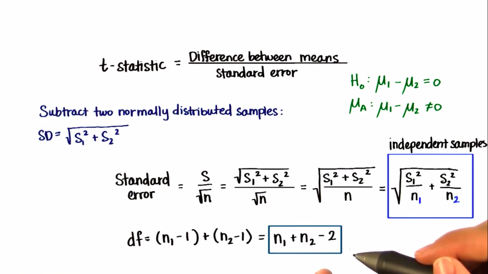
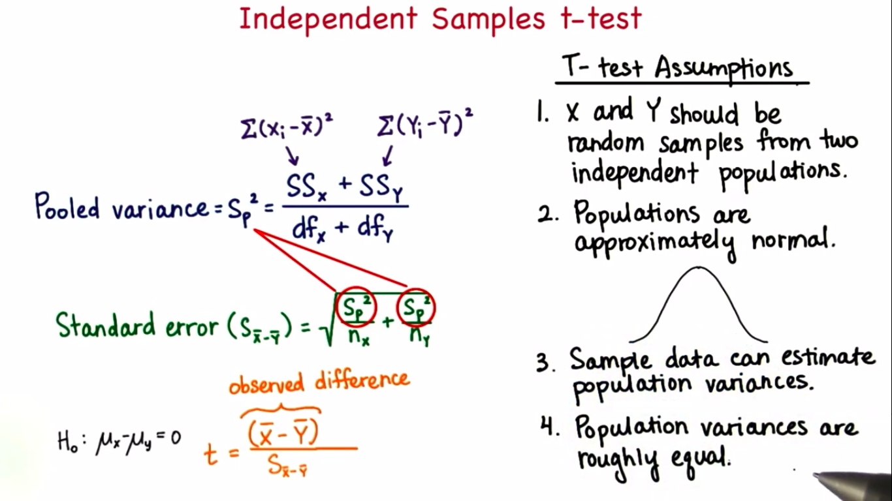

# Summary of this videos

   - **Lesson 24 (t-Tests)** 
        - **t-Test**:
             - We don not need to know the population parameters.
             - is a type of inferential statistic used to determine if there is a significant difference between the means of two groups, which may be related in certain features. 
        - **Degrees of Freedom (DF)**:
            - Indicate the number of independent values that can vary in an analysis without breaking any constraints.  
            - It is the number of values that are free to vary as you estimate parameters.    
            - If you have to choose n numbers, then you have **n-1 degrees of freedom**.
            - If you have to choose n*n table, then you have **(n-1)*(n-1) = (n-1)^2 degrees of freedom**.  
            - As the degrees of freedom increases, the t-distribution better approximates the normal distribution.
            - **t-table**:-
                  
            - **t-statistics**:
                - t = x̅ - μ / (S / √n) 
            - CI = μ (-/+) t-statistics * (S / √n)
            - Margin of error = t * S / √n
        - **Types of Designs** (Dependent Samples):
            - Repeated measures design:
              - H0: **μ1 = μ2**
            - Longitudinal:
              - H0: **μ-time1 = μ-time2**
            - Pretest posttest:-
              - H0: **μ-pre = μ-post** 
        - **Effect size**:
            - Is a statistical concept that measures the strength of the relationship between two variables on a numeric scale
            - **Types of Effect Size measures**:
                1. Difference measures:
                   - Mean difference
                   - Standaedized mean differences
                     - Cohen’s d - SD units 
                       - d = x̅ - μ / S    
                2. Correlation measures:
                   - r^2 - Coefficient of determination:
                     - It's the proportion or percentage of variation in one variable that is related to another variable. 
                     - r^2 ranges from **0.00 to 1.00**
                       - 0.00 means the variable are not related.
                       - 1.00 means the variable are perfectlt related. 
                     - r^2 = t^2 / t^2 + DF
                       - **t** is the value we get from t-test  
        - **Results Sections**:
            1. Descriptive Statistics (mean, SD)
               - Text
               - Graphs
               - Tables    
            2. Inferential Statistics
               - Hypothesis test α
                 - Kind of test - sample t-test
                 - test statistics
                 - DF
                 - p-value
                 - direction of test   
                 - **APA Style**:
                     - t(DF) = x.xx, p = .xx, dirction
                       - ex: t(24) = -2.50, p < 0.05, one-tailed  
               - Confidence Intervals CI:
                 - Confidence level
                 - Lower Limit
                 - Upper Limits  
            3. Effect Size measures
               - d (Cohen’s d)
                 - **APA style**: x.xx 
               - r^2
                 - **APA style**: .xx

   - **Lesson 25 (Problem set 10: t-Tests)** 
        - Questions about t-tests and effect size 

   - **Lesson 26 (t-Tests continued)** 
        - **Independent Samples**: Between subject design
            - Advantages:
              1. Carry over affects
                 - Second measurement can be affected by first treatment
              2. Order may influnce results.     

            - Experimental
            - Observational  

            - H0 : μ1 - μ2 = 0
            - HA : - μ1 - μ2 > 0
                   - μ1 - μ2 < 0
                   - μ1 - μ2 != 0
            - t = x̅1 - x̅2 / Standared error
              - Reject H0 if p < α
              - Fail to reject H0 if p > α

        - standared Error:
             
    
        - Assumptions:
             

   - **Lesson 27 (Problem set 11: t-Tests continued)**
        - Questions about t-tests and Independant samples

   - **Lesson 28 (One-Way ANOVA)**
        - t-test between more than two samples.
        - **Number of t-tests with n samples** = n! / 2! * (n - 2)!
        - **ANOVA between group variability**
            - The smaller the distance between sample means, the less likely population means will differ significantly.
            - The greater the distance between sample means, the more likely population means will differ significantly.    
        - **ANOVA within group variability**
            - The greater the variability of each individual sample, the less likely population means will differ significantly.
            - The smaller the variability of each individual sample, the more likely population means will differ significantly.  
        - Analysis of Variance **ANOVA**   
          - H0: μ1 = μ2 = .. = μn
          - HA: μ1 != μm At least one pair of samples is significantly different 
        - **F-statistics**
            - = (SS-between / df-between) / (SS-within / df-within)
            - = MS-between / MS-within
            - It is never be **negative**
            - SS-between = n * Σ(x̅k - x̅G)^2
            - SS-within  = Σ(Xi - x̅k)^2
        - SS-total = SS-between + SS-within = Σ(Xi - x̅)^2
        - df-total = df-between + df-within = N - 1   

   - **Lesson 29 (Problem set 12: One-Way ANOVA)**
        - Questions about ANOVA test

   - **Lesson 30 (One-Way ANOVA continued)**
        - Cohen's d for multiple comparisons
          d = x̅1 - x̅2 / √MS-within
        
        - η2 : Proportion of total variation that is due to between group differences(explained variations)
          - η2 = SS-between / SS-total
          - η2 - SS-between / SS-between + SS-within

   - **Lesson 31 (Preplem Set 13: ANOVA continued)**  
        - Questions about ANOVA test and multiple comparisons    

   - **Lesson 32 (Correlation)** 
        - Relationship between two variables.
          - one variable is dependent on another variable
          - if y dependent on x:
            - so, x called:
              - Predictor
              - explanatory
              - independent variable
            - and y called:
              - outcome
              - response
              - dependent
          - The best way to show the relationship between two numerical variables is with **Scatter plot**.
          - A strong ralationship has direction:
            - Positive:
              - if x increases, y increases
            - Negative:
              - if x increases, y decreases
        - **Correlation Coefficient r - Pearson's r**    
            - r = Cov(x,y) / Sx * Sy
            - It shows how the two variables vary apart from each other.
        - **Coefficient of determination r^2**
            - It's the percentage of the variation in Y explained by the variation in X.  

   - **Lesson 33 (Problem Set 14: Correlation)** 
        - Questions about Correlation and it's types.
   
   - **Lesson 34 (Regression)**
        - **Regression**
            - is a statistical analysis assessing the association between two variables. It is used to find the relationship between two variables. 
            - **Y = a + bX + u**
                - Y = the variable that you are trying to predict (dependent variable).
                - X = the variable that you are using to predict Y (independent variable).
                - a = the intercept.
                - b = the slope.
                  - b = r(standard deviation of y-values)/(standard deviation of x-values) 
                  - b = r * (σy / σx)
                  - r is peaeson's R     
                - u = the regression residual.
            - Line of best fit
              - minimize sum of absolute residuals.
              - minimize sum of squared residuals   

   - **Lesson 35 (Problem Set 15: Regression)**
        - Questions about Regression.

   - **Lesson 36 (Chi-Squared tests)**
        - **Interval Data**
            - Ranks with equal intervals
        - **Ordinal Data**
            - Ranks
        - **Ratio Data**
            - Ranks with equal intervals and an absolute zero
        - **Parametric Test**: numeric data
            - z-test
            - t-test
            - ANOVA (f-test)
            - Correlation
            - Regression 
        - **Non-Parametric test**
            - Chi-squared test 
            - The **Chi-Square Test** gives a **p** value to help you decide!
              - **p** is the probability the variables are independent.   
            - This test only works for **categorical data** (data in categories), such as Gender {Men, Women} or color {Red, Yellow, Green, Blue} etc, but not numerical data such as height or weight.
            - **This is the formula for Chi-Square**:

                - **Χ2 = Σ(O − E)^2 / E** 

                  - **Σ**: means to sum up (see Sigma Notation)
                  - **O**: each Observed (actual) value
                  - **E**: each Expected value

   - **Lesson 37 (Problem Set 16: Chi-Squared tests)**
        - Questions about Chi-Squared tests.

   - **Lesson 38 (Lessons 10-16 Review)**

# What’s new for you ?

   - t-Tests
   - ANOVA test
   - Chi-Squared tests

# Resources ? 

   - https://www.investopedia.com/terms/t/t-test.asp#:~:text=Key%20Takeaways-,A%20t%2Dtest%20is%20a%20type%20of%20inferential%20statistic%20used,of%20hypothesis%20testing%20in%20statistics.
   - https://statisticsbyjim.com/hypothesis-testing/degrees-freedom-statistics/
   - https://www.graphpad.com/quickcalcs/
   - https://www.educba.com/z-score-vs-t-score/
   - https://www.statisticssolutions.com/statistical-analyses-effect-size/#:~:text=Effect%20size%20is%20a%20statistical,variables%20on%20a%20numeric%20scale.
   - http://www.mathisfunforum.com/viewtopic.php?id=17716
   - https://www.investopedia.com/terms/r/regression.asp#:~:text=Regression%20is%20a%20statistical%20method,(known%20as%20independent%20variables).
   - https://www.mathsisfun.com/data/chi-square-test.html
   - http://www.mathisfunforum.com/viewtopic.php?id=9931
   - https://www.khanacademy.org/math/statistics-probability/analysis-of-variance-anova-library
   - https://www.analyticsvidhya.com/blog/2018/01/anova-analysis-of-variance/

 
