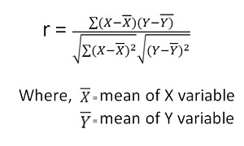
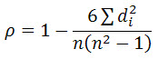

# 1- What ’re the methods that you used ?

   - list()
   - map()
   - input()
   - numpy.median()
   - scipy.stats.mode()  
   - math.erf
   - math.facorial
   - random
   - append()
   - sklearn.linear_model
        - fit()
        - intercept_
        - coef_
   - statistics lib 

# 2- Explain each method ..

   1. **Mean, Median, and Mode**
        - Given an array, X, of N integers
          - calculate and print the respective mean, median, and mode on separate lines.
          - If your array contains more than one modal value, choose the numerically smallest one.
          - Sol:-
            - compute mean using sum and length of list
            - compute median using numpy.median()
            - compute mode using scipy.stats.mode()

   2. **Weighted Mean**
        - Given an array, X, of N integers and an array, W, representing the respective weights of X's elements.
          - calculate and print the weighted mean of X's elements.
          - Your answer should be rounded to a scale of 1 decimal place
          - Sol:-
            compute wighted mean by mul w_list with X_list and add it to sum.

   3. **Quartiles**
        - Given an array, X, of N integers
          - calculate the respective first quartile (Q1), second quartile (Q2), and third quartile (Q3).
          - It is guaranteed that Q1, Q2, and Q3 are integers.  
          - Sol:-
            - compute median to select the median value
            - Verify that the total data is even or odd 

   4. **Standard Deviation**
        - Given an array, X, of N integers
          - Calculate and print the standard deviation.
          - Your answer should be in decimal form, rounded to a scale of 1 decimal place 
          - Sol:-
            - compute mean
            - compute (x - mean)^2
            - compute sqrt((x - mean)^2 / len) 

   5. **Interquartile Range**
        - The interquartile range of an array is the difference between its first (Q1) and third (Q2) quartiles
          - Given an array, X, of N integers and an array, F, representing the respective frequencies of X's elements
          - Construct a data set, S, where each xi occurs at frequency fi.
          - Then calculate and print S's interquartile range, rounded to a scale of 1 decimal place.
          - Sol:-
            - compute median to select median value.
            - loop in the elements and frequencies lists to create the new list. 
            - Verify that the total data is even or odd
             
   6. **Basic Probability**
        - In a single toss of 2 fair (evenly-weighted) six-sided dice.
        - find the probability that their sum will be at most 9.
        - Sol:-
          - It's 30 / 36 = 0.8333333333333336 for:-
            - (1,1),(1,2),(1,3),(1,4),(1,5),(1,6),
            - (2,1),(2,2),(2,3),(2,4),(2,5),(2,6),
            - (3,1),(3,2),(3,3),(3,4),(3,5),(3,6),
            - (4,1),(4,2),(4,3),(4,4),(4,5),
            - (5,1),(5,2),(5,3),(5,4),
            - (6,1),(6,2),(6,3)

   7. **More Dice**
        - In a single toss of 2 fair (evenly-weighted) six-sided dice
        - find the probability that the values rolled by each die will be different and the two dice have a sum of 9.
        - Sol:-
          - It's 4 / 36 = 0.1111111111111111 for:-
            - (1,5),(2,4),(4,2),(5,1)

   8. **Compound Event Probability**
        - There are 3 urns: X, Y and Z:-
          - Urn X contains 4 red balls and 3 black balls.
          - Urn Y contains 5 red balls and 4 black balls.
          - Urn Z contains 4 red balls and 4 black balls.
          - One ball is drawn from each urn.
          - What is the probability that the 3 balls drawn consist of 2 red balls and 1 black ball?
          - Sol:-
               X      Y         Z
              red     red       black
             black    red        red
              red    black       red
            - So, We have three different combinations 

   9. **Conditional Probability**
         - Suppose a family has 2 children, one of which is a boy.
         - What is the probability that both children are boys?
         - Sol:-
           - Their are three different possibilities
           - First children is boy and second is boy
           - First children is boy and second is girl
           - First children is girl and second is girl
           - probability of both children are boys will be 1/3

   10. **Cards of the Same Suit**
        - You draw 2 cards from a standard 52-card deck without replacing them.
        - What is the probability that both cards are of the same suit?
        - Sol:-
          1. Initially we have 52 cards, 13 * 4 (4 suites).
             - There are 13 ways to select a color card out of 52.
          2. Then again if we pick one more card, there are 12 remaining of the same color
             - out of total 51 remainig cards.
          3. No. of ways to select 2 cards = (1) * (2) = (13/52) * (12/51) = 3/51.
          4. This is for 1 color, as there are 4 colors
             - total = (4 * 3)/51 = 12/51.

   11. **Drawing Marbles**
        - A bag contains 3 red marbles and 4 blue marbles.
        - Then, 2 marbles are drawn from the bag, at random, without replacement.
        - If the first marble drawn is red, what is the probability that the second marble is blue?
        - Sol:-
          - After drawing the first red marble, we are left with 2 red marbles and 4 blue marbles
          - So, the probability of drawing a second blue marble is: 4 / 6 = 2/3 = 0.666

   12. **Binomial Distribution I**
        - The ratio of boys to girls for babies born in Russia is 1.09 : 1.
        - If there is 1 child born per birth.
        - what proportion of Russian families with exactly 6 children will have at least 3 boys?
        - Sol:- 
          - compute factorial of given n 
          - then use factorial to compute binomial of given values as:
            - f = factorial(n) / (factorial(n - x) * factorial(x))
            - f * p^x * (1.0 - p)^(n-x)

   13. **Binomial Distribution II**
        - A manufacturer of metal pistons finds that, on average, 12% of the pistons they manufacture are rejected because they are incorrectly sized.
        - What is the probability that a batch of 10% pistons will contain:
          - No more than 2 rejects?
          - At least 2 rejects? 
        - Sol:-
          - using factorial to compute combination as:
            comb(n, r) = factorial(n) / (factorial(r) * factorial(n - r))  

   14. **Geometric Distribution I**
        - The probability that a machine produces a defective product is 1/3.
        - What is the probability that the 1st defect is found during the 5st inspection?  
        - Sol:-
          - using given probability, compute it's complement 
          - then compute geometric distribution by mul the probability with it's complement with inspection value -1 

   15. **Geometric Distribution II**
        - The probability that a machine produces a defective product is 1/3.
        - What is the probability that the 1st defect is found during the first 5 inspections?  
        - Sol:-
          - using given probability, compute it's complement 
          - then compute geometric distribution by mul the probability with it's complement with inspection value - 1 if in range that inspection value.

   16. **Poisson Distribution I**
        - A random variable, X, follows Poisson distribution with mean of 2.5.
        - Find the probability with which the random variable X is equal to 5.      
        - Sol:-
          - compute factorial of given n
          - compute the probability with which the random variable X is equal to 5 as:
             - result = ((mean ^ k) * (e ^ -mean)) /  factorial(k)

   17. **Poisson Distribution II**
        - Sol:-
          - given two equations of two unknown variables x and y 
            - Ca = 160 + 40 X^2
            - Cb = 128 + 40 Y^2
            - substutate x and y by input value + that value ^2 

   18. **Normal Distribution I**
        - In a certain plant, the time taken to assemble a car is a random variable, X,
          - having a normal distribution with a mean of 20 hours and a standard deviation of 2 hours.
          - What is the probability that a car can be assembled at this plant in:
            - Less than 19.5 hours?
            - Between 20 and 22 hours?
        - Sol:-
          - using math.erf to get z-score value from z-table  
          - then compute comulative value using comulative method as:
            - cumulative(mean, std, value): 0.5 * (1 + math.erf((value - mean) / (std * (2 ^ 0.5))))
           
   19. **Normal Distribution II**
        - The final grades for a Physics exam taken by a large group of students have
          - a mean of μ = 70 and a standard deviation of σ = 10.
          - If we can approximate the distribution of these grades by a normal distribution, what percentage of the students:
            - Scored higher than 80 (i.e., have a grade > 80)?
            - Passed the test (i.e., have a grade >= 60)?
            - Failed the test (i.e., have a grade < 60)?
        - Sol:- 
          - using math.erf to get z-score value from z-table  
          - then compute comulative value using comulative method as:
            - cumulative(mean, std, value): 0.5 * (1 + math.erf((value - mean) / (std * (2 ^ 0.5))))  

   20. **The Central Limit Theorem I**
        - A large elevator can transport a maximum of 9800 pounds.
        - Suppose a load of cargo containing 49 boxes must be transported via the elevator.
        - The box weight of this type of cargo follows a distribution with a mean of μ = 205 pounds and a standard deviation of σ = 15 pounds.
        - Based on this information, what is the probability that all 49 boxes can be safely loaded into the freight elevator and transported?
        - Sol:-
          - using math.erf to get z-score value from z-table  
          - then compute comulative value using comulative method as:
            - cumulative(mean, std, value): 0.5 * (1 + math.erf((value - mean) / (std * (2 ^ 0.5)))) 
          - Compute new mean and new std then compute the z-score

   21. **The Central Limit Theorem II**

        - The number of tickets purchased by each student for the University X vs.
        - University Y football game follows a distribution that has:
          - a mean of µ = 2.4
          - a standard deviation of σ = 2.0.
        - Suppose that a few hours before the game starts, there are 100 eager students standing in line to purchase tickets.
        - If there are only 250 tickets left, what is the probability that all 100 students will be able to purchase the tickets they want? 
        - Sol:-
          - define a function that calculate z score and return the probability according to CLT formula.  
            - 0.5 * (1 + math.erf((x - mean) / (sd * (2 ^ 0.5))))

   22. **The Central Limit Theorem III**

        - You have a sample of 100 values from a population with
          - mean µ = 500
          - standard deviation σ = 80.
        - Compute the interval that covers the middle 95% of the distribution of the sample mean
          - in other words, compute A and B such that P(A < x < B) = 0.95. Use the value of z = 1.96.
        - Note that z is the z-score. 
        - Sol:-
          - using the given values, compute the CI interval as:
            - ci = value_ci * (std / math.sqrt(n))

   23. **Pearson Correlation Coefficient I**

        - Given two n-element data sets, X and Y 
        - Calculate the value of the Pearson correlation coefficient.
        - Sol:-
          - compute the Pearson Correlation Coefficient using the formula: 
            -   

   24. **Spearman's Rank Correlation Coefficient**

        - Given two n-element data sets, X and Y.
        - calculate the value of Spearman's rank correlation coefficient.
        - Sol:-
          calc the value of Spearman's rank correlation coefficient using rank method and the formula :-
          - 

   25. **Least Square Regression Line**
        - A group of five students enrolls in Statistics immediately after taking a Math aptitude test.
        - Each student's Math aptitude test score, x, and Statistics course grade, y.
          - can be expressed as the following list of (x,y) points:
            1. (95,85)
            2. (85,95)
            3. (80,70)
            4. (70,65)
            5. (60,70)
        - If a student scored an 80 on the Math aptitude test.
        - what grade would we expect them to achieve in Statistics?
        - Determine the equation of the best-fit line using the least squares method, then compute and print the value of y when x = 80.
        - Sol:-
          - given the list of data 
            - x = [95, 85, 80, 70, 60]
            - y = [85, 95, 70, 65, 70]
          - compute the mean for x and y 
          - compute x square and xy to formulate the regression line

   26. **Pearson Correlation Coefficient II**

        - The regression line of y on x is 3x + 4y + 8 = 0
        - and the regression line of x on y is 4x + 3y +7 = 0
        - What is the value of the Pearson correlation coefficient?
        - Sol:-
          - **Regression X**:
              - 3x + 4y + 8 = 0
              - -4y = 3x + 8
              - -y = 3x/4 + 8/4
              - -y = 3x/4 + 4 (reverse signal)
              -  y = -3x/4 - 4
              -  bx = -3/4
          - **regression Y**:
              - 4x + 3y + 7 = 0
              - -4y = 3y + 7
              - -x = 3x/4 + 7/4 (reverse signal)
              -  y =  -3x/4 - 7/4
              - by = -3/4
          - r² = bx * by
          - r² = -3/4 * -3/4
          - r² = 9/16
          - r +/- 3/4
          - if bx = by then
          - r = -3/4  

   27. **Multiple Linear Regression**

        - you have a simple equation:
          - Y = a + b1.f1 + b1.f2 + ... + bm.fm
        - for m + 1 real constants (a, f1, f2, ... , fm).
          - We can say that the value of Y depends on m features.
        - you studies this equation for n different feature sets (f1, f2, f3, ..., fm) and records each respective value of Y.
        - If you have q new feature sets, find the value of Y for each of the sets?
         - Sol:-
           - using sklearn linear_model
             - we formulate liear regression between x and y using LinearRegression() method
             - Then fit the model to x and y list
             - Then compute the intercept and coefficient.
   
# 3- What’s new for you ?

   - Geometric Distribution
   - Poisson Distribution 
   - Pearson Correlation Coefficient

# 4- Resources ? 

   - https://www.w3schools.com/python/ref_math_erf.asp
   - https://www.google.com/search?safe=active&source=hp&ei=_75wX9rGBI-Wa-X8vOAM&q=math.erf+python&oq=math.erf&gs_lcp=CgZwc3ktYWIQAxgBMgIIADICCAAyAggAMgQIABAeMgQIABAeMgQIABAeMgQIABAeMgQIABAeMgQIABAeMgQIABAeOgUIABCxAzoCCC46CAguELEDEIMBOggIABCxAxCDAToFCC4QsQM6BAguEAo6BAgAEApQBljAD2CAIWgAcAB4AIAB2gGIAZ4HkgEFMC42LjGYAQCgAQGqAQdnd3Mtd2l6&sclient=psy-ab
   - https://www.mathsisfun.com/data/standard-normal-distribution.html
   - https://www.statisticshowto.com/geometric-distribution/
   - https://brilliant.org/wiki/poisson-distribution/
   - https://stackoverflow.com/questions/48711815/poisson-distribution
   - https://en.wikipedia.org/wiki/Pearson_correlation_coefficient
   - https://en.wikipedia.org/wiki/Spearman%27s_rank_correlation_coefficient
   - https://scikit-learn.org/stable/modules/generated/sklearn.linear_model.LinearRegression.html
   - https://realpython.com/linear-regression-in-python/
