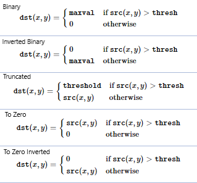

# 1- What ’re the methods that you used ?

   - OpenCV
        - imread()
        - erode()
        - dilate()
        - threshold()
        - adaptiveThreshold()
   
   - matplotlib
        - pyplot.imshow()   
        - pyplot.set_title()
        - pyplot.subplots()        
 
   - numpy
        - ones()

# 2- Explain each method ..

   1. **Erosion and Dilation of images using OpenCV**
        - Read image using openCV imread method  
        - Create a kernel of ones with dimensions 5x5 using numpy ones method.
        - Apply erosion and dilation transformations on our image using openCv erode and dilate methods by assigning:
          - source img
          - our kernel
          - number of times erosion and dilation are applied 
          
   - **Thresholding techniques using OpenCV**
        - Is a very popular segmentation technique
        - A threshold is a value which has two regions on its either side i.e. below the threshold or above the threshold.
        - This technique of thresholding is done on grayscale images.
          - So initially, the image has to be converted in grayscale color space.  
        - The different Simple Thresholding Techniques are:
                

   2. **Thresholding techniques using OpenCV**
        - Read image using openCV imread method
        - Convert the image to grayscale format using cvtColor method by specifing COLOR_BGR2GRAY arg.
        - Apply different threshold techniques using openCV threshold method by specifing:
          - source image
          - min value of threshold
          - max value of threshold
          - threshold technique
   
   - **Adaptive Thresholding techniques using OpenCV**
        - Adaptive thresholding is the method where the threshold value is calculated for smaller regions.
        - The different Adaptive Thresholding Techniques are: 
          - **ADAPTIVE_THRESH_MEAN_C**:
             - Threshold Value = (Mean of the neighbourhood area values – constant value).
             - In other words, it is the mean of the blockSize×blockSize neighborhood of a point minus constant.
          - **ADAPTIVE_THRESH_GAUSSIAN_C**:
              - Threshold Value = (Gaussian-weighted sum of the neighbourhood values – constant value).
              - In other words, it is a weighted sum of the blockSize×blockSize neighborhood of a point minus constant.
              
   3. **Adaptive Thresholding techniques using OpenCV**
        - Read image using openCV imread method
        - Convert the image to grayscale format using cvtColor method by specifing COLOR_BGR2GRAY arg.
        - Apply Adaptive threshold techniques using openCV adaptiveThreshold method by specifing:
          - Source image
          - Maximum value that can be assigned to a pixel.
          - Adaptive method decides how threshold value is calculated.
            - ADAPTIVE_THRESH_MEAN_C
            - ADAPTIVE_THRESH_GAUSSIAN_C
          - The type of thresholding to be applied.
          - Size of a pixel neighborhood that is used to calculate a threshold value.
          - Constant value that is subtracted from the mean or weighted sum of the neighbourhood pixels.   
   
   - **Otsu Thresholding** 
        - Process the input image
        - Obtain image histogram (distribution of pixels)
        - Compute the threshold value T
          - It automatically calculates a threshold value from image histogram for a bimodal image.
          - The algorithm finds the optimal threshold value and returns you as the second output, retVal. 
          - If Otsu thresholding is not used, retVal is same as the threshold value you used.
        - Replace image pixels into white in those regions, where saturation is greater than T and into the black in the opposite cases. 
   
   4. **Otsu Thresholding techniques using OpenCV**
        - Read image using openCV imread method
        - Convert the image to grayscale format using cvtColor method by specifing COLOR_BGR2GRAY arg.
        - Apply Otsu threshold technique using openCV threshold method by specifing:
          - source image
          - min value of threshold
          - max value of threshold
          - threshold technique 
            - cv2.THRESH_BINARY + cv2.THRESH_OTSU  
                   
# 3- What’s new for you ?

   - Reviewing on Image transformations techniques and threshold.
    
# 4- Resources ? 

   - https://docs.opencv.org/3.4/d4/d86/group__imgproc__filter.html#gaeb1e0c1033e3f6b891a25d0511362aeb
   - https://www.geeksforgeeks.org/erosion-dilation-images-using-opencv-python/?ref=lbp
   - https://opencv-python-tutroals.readthedocs.io/en/latest/py_tutorials/py_imgproc/py_morphological_ops/py_morphological_ops.html
   - https://docs.opencv.org/3.4/db/df6/tutorial_erosion_dilatation.html
   - https://docs.opencv.org/3.4/d4/d86/group__imgproc__filter.html#ga4ff0f3318642c4f469d0e11f242f3b6c
   - https://www.geeksforgeeks.org/python-thresholding-techniques-using-opencv-set-1-simple-thresholding/?ref=lbp
   - https://www.geeksforgeeks.org/python-thresholding-techniques-using-opencv-set-2-adaptive-thresholding/?ref=lbp
   - https://www.tutorialspoint.com/opencv/opencv_adaptive_threshold.htm#:~:text=Adaptive%20thresholding%20is%20the%20method,()%20of%20the%20Imgproc%20class.
   - https://www.learnopencv.com/otsu-thresholding-with-opencv/
   - https://medium.com/@hbyacademic/otsu-thresholding-4337710dc519
