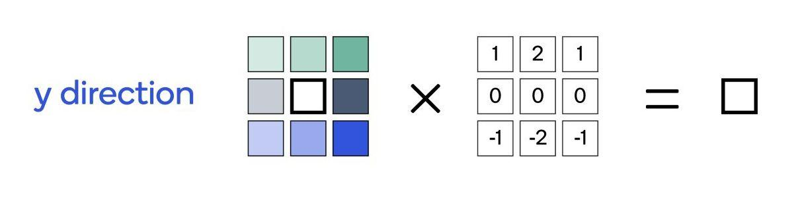
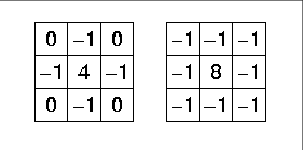
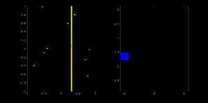

# 1- What ’re the methods that you used ?

   - **OpenCV**
        - VideoCapture()
        - read()
        - cvtColor()
        - Sobel()
          - Sobel_X
          - Sobel_Y 
        - Laplacian()
        - imshow()
        - waitkey()
        - destroyAllWindows() 
        - release()
        - Canny()
        - HoughLinesP()
        - line()
        
   - **matplotlib**
        - pyplot.imshow()   
        - pyplot.set_title()
        - pyplot.subplots()     

# 2- Explain each method ..

   - **Edge Detection Applications**
        - Reduce unnecessary information in an image while preserving the structure of image.
        - Extract important features of image like curves, corners and lines.
        - Recognizes objects, boundaries and segmentation.
        - Plays a major role in computer vision and recognition.
        
   - **Sobel and Laplacian methods**
        - They are types of gradient filters or High-pass filters.
          - **Sobel Operator**
              - Is a discrete differentiation operator.
              - It computes an approximation of the gradient of an image intensity function.
              - It calculates the first derivatives of the image separately for the X and Y axes.
              - It combines Gaussian smoothing and differentiation.
              - **Horizontal changes - SobelX**
                  - This is computed by convolving I with a kernel Gx with odd size.
                  
              - **Vertical changes - SobelY**
                  - This is computed by convolving I with a kernel Gy with odd size.
                   
              - At each point of the image, we calculate an approximation of the gradient in that point by combining SobelX ans SobelY 
                - G = √Gx^2 + Gy^2
          - **Laplacian methods**
              - uses only one kernel.
              - It calculates second order derivatives in a single pass. 
                              

   1. **Edge detection using Sobel and Laplacian methods** 
        - **VideoCapture syntax**: 
            - cv2.VideoCapture(0):
              - Means first camera or webcam.
            - cv2.VideoCapture(1):
              - Means second camera or webcam.
            - cv2.VideoCapture("file name.mp4"):
              - Means video file
        - Capture video from webcam using openCV VideoCapture(0)
        - Read frames using read() method
        - Convert frame space color from BGR to RGB
        - Apply Sobel_X to our frame using 
          - cv2.Sobel(src, ddepth, xorder, yorder, dst, kernelsize)
            - src 
              - input image.
            - ddepth
              - output image depth
            - dx
              - order of the derivative x. 
              - in x-image derivative the order is (xorder = 1, yorder = 0)
            - dy
              - order of the derivative y. 
              - in y-image derivative the order is (xorder = 0, yorder = 1) 
            - dst	
              - output image of the same size and the same number of channels as src .
            - ksize
              - size of the extended Sobel kernel; it must be 1, 3, 5, or 7.  
        - Apply Sobel_Y to our frame as Sobel_X
        - Apply Laplacian to our frame using 
          - cv.Laplacian(src, ddepth, dst, ksize)
            - src
              - Source image.
            - dst
              - Destination image of the same size and the same number of channels as src .
            - ddepth
              - Desired depth of the destination image.
            - ksize
              - Aperture size used to compute the second-derivative filters.
        - Then show all images after applying different filters            

   - **HSV colorspace**
        - HSV (hue, saturation, value)
          - Since the hue channel models the color type
            - It is very useful in image processing tasks that need to segment objects based on its color.
            - Variation of the saturation goes from unsaturated to represent shades of gray and fully saturated (no white component).       
            - Value channel describes the brightness or the intensity of the color.
             
          - Since colors in the RGB colorspace are coded using the three channels, it is more difficult to segment an object in the image based on its color.

   2. **Real-Time Edge Detection using OpenCV** 
        - Capture video from webcam using openCV VideoCapture(0)   
        - Read frames from cam
        - Convert it from BGR to RGB and HSV format
        - Use inRnage method to detect an object based on the range of pixel values in the HSV colorspace by defining:
          - define range of red color in HSV as lower_red and upper_red
        - Apply inRange method with args to extract our mask
          - hsv frame
          - lower_red
          - upper_red
        - Then Apply bitwise and operation between mask and original image
        - Use Canny edge detetion as second way to detect edges by defining it's args as:
          - frame
          - min value
          - max value
        - Then show aoriginal frame, bitwise_and output, and canny output         

   - **Hough Transform**
        - The **Hough transform** converts a line in image space to a point in Hough space. 
        - A line can be represented as
          - y = mx + c 
          - in parametric form, as r = xcosθ + ysinθ
            - r is the perpendicular distance from origin to the line
            - θ is the angle formed by this perpendicular line and horizontal axis measured in counter-clockwise
            
        - **how Hough Transform works for lines**
            1. First it creates a 2D array or accumulator (to hold values of two parameters) and it is set to zero initially.
            2. Let rows denote the r and columns denote the (θ)theta.
            3. Size of array depends on the accuracy you need. Suppose you want the accuracy of angles to be 1 degree, you need 180 columns(Maximum degree for a straight line is 180).
            4. For r, the maximum distance possible is the diagonal length of the image. So taking one pixel accuracy, number of rows can be diagonal length of the image.    
            
             
   3. **Line detection in python with OpenCV | Houghline method**
        - Read our image using imread method
        - Convert it to gray image for edge detection using cvtColor method with cv2.COLOR_BGR2GRAY arg
        - Detemine edges using Canny edge detection method 
        - Detrmine lines using HoughLinesP method of openCV by specifing the follwoing params:
          - image 
            - edges detemining by canny
          - rho 
            - Distance resolution of the accumulator in pixels.
          - theta 
            - Angle resolution of the accumulator in radians.              
          - threshold
            - Accumulator threshold parameter for votes
          - minLineLength
            - Minimum line length. Line segments shorter than that are rejected.  
          - maxLineGap
            - Maximum allowed gap between points on the same line to link them.
        - Then loop through each line to draw it using line method of OpenCV.    
            
# 3- What’s new for you ?

   - Laplacian methods
   - Real-Time Edge Detection using OpenCV

# 4- Resources ? 

   - https://www.geeksforgeeks.org/python-program-to-detect-the-edges-of-an-image-using-opencv-sobel-edge-detection/?ref=lbp  
   - https://homepages.inf.ed.ac.uk/rbf/HIPR2/log.htm
   - https://opencv-python-tutroals.readthedocs.io/en/latest/py_tutorials/py_imgproc/py_gradients/py_gradients.html
   - https://www.bogotobogo.com/python/OpenCV_Python/python_opencv3_Image_Gradient_Sobel_Laplacian_Derivatives_Edge_Detection.php
   - https://en.wikipedia.org/wiki/Sobel_operator
   - https://www.youtube.com/watch?v=7aNi1m1uXxc
   - https://homepages.inf.ed.ac.uk/rbf/HIPR2/log.htm
   - https://docs.opencv.org/3.4/da/d97/tutorial_threshold_inRange.html
   - https://opencv-python-tutroals.readthedocs.io/en/latest/py_tutorials/py_imgproc/py_colorspaces/py_colorspaces.html
   - https://www.geeksforgeeks.org/line-detection-python-opencv-houghline-method/?ref=lbp
   - https://opencv-python-tutroals.readthedocs.io/en/latest/py_tutorials/py_imgproc/py_houghlines/py_houghlines.html
   - https://www.youtube.com/watch?v=4zHbI-fFIlI
   - https://www.geeksforgeeks.org/python-opencv-cv2-line-method/
   - https://www.programmersought.com/article/55064229527/
   - https://rsdharra.com/blog/lesson/14.html#:~:text=First%20of%20all%2C%20let's%20detect,hence%20P%20in%20the%20name).
   
