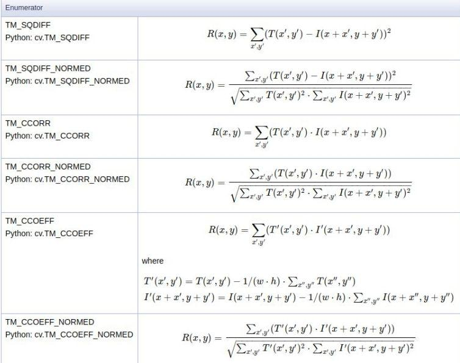
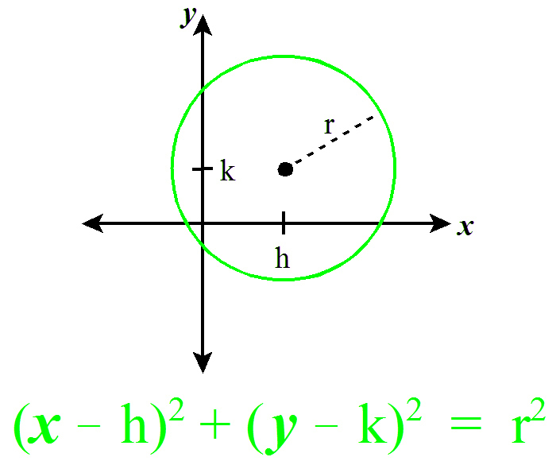

# 1- What ’re the methods that you used ?

   - **OpenCV**
        - imread()
        - VideoCapture()
        - read()
        - cvtColor()
        - imshow()
        - waitkey()
        - destroyAllWindows() 
        - release()
        - Canny()
        - matchTemplate()
        - rectangle()
        - minMaxLoc()
        - CascadeClassifier()
        - detectMultiScale()
        - blur()
        - HoughCircles()
        - circle()

   - **matplotlib**
        - pyplot.imshow()   
        - pyplot.set_title()
        - pyplot.subplots() 
        
   - **numpy**
        - copy() 
        - linspace()  
        - uint16()    

# 2- Explain each method ..

   - **Template Matching**
        - the standard approach to template matching using **cv2.matchTemplate** is not very robust.
          
          - emplate matching fails to work when the size of the template image (left) does not match the size of the region in the image (right).
        - **How Template Matching Works?**
            1. The template image simply slides over the input image (as in 2D convolution)
            2. The template and patch of input image under the template image are compared.
            3. The result obtained is compared with the threshold.
            4. If the result is greater than threshold, the portion will be marked as detected.
            5. In the function **cv2.matchTemplate(img_gray,template,cv2.TM_CCOEFF_NORMED)**
               - First parameter is the mainimage
               - Second parameter is the template to be matched
               - Third parameter is the method used for matching.
                 - **TM_SQDIFF**: the best matches can be found as global minimums
                 - **TM_CCORR** or **TM_CCOEFF**: the best matches can be found as global maximums
                   
  
   - **Multi scaling Template Matching**            
        - The process of Multi scaling is as follows:
          1. Loop over the input image at multiple scales (i.e. make the input image progressively smaller and smaller).
          2. Apply template matching using **cv2.matchTemplate** and keep track of the match with the largest correlation coefficient (along with the x, y-coordinates of the region with the largest correlation coefficient).
          3. After looping over all scales, take the region with the largest correlation coefficient and use that as your “matched” region.
  
   1. **Template matching**
        1. Load main image and template image and convert them to grayscale images.
        2. Extract width and height of template.
        3. Match the image with template using OpenCV matchTemplate method by specifying:
           - our main image after converting to gray.
           - our template
           - method for matching, here we will use TM_CCOEFF_NORMED because we use threshold.
        4. Determine threshold and the location of template in the image by using numpy where method
           - np.where(match >= threshold)
        5. Loop for all points in matching locations and draw rectangle over matches using OpenCV rectangle method
        
   2. **Multi scaling Template Matching** 
        1. Load main image and template image and convert them to grayscale images.
        2. Extract template edges using OpenCV Canny method.
        3. Extract width and height of template.  
        4. Loop over the multiple scales of the image sing the np.linspace function by specifying:
           - The starting value
           - The ending value
           - The number of equal chunk slices in between.   
           - we’ll start from 100% of the original size of the image and work our way down to 20% of the original size in 20 equally sized percent chunks.
        5. We resize the image according to the current scale and compute the ratio of the old width to the new width.
        6. We check that the input image is larger than our template matching.
           - If the template is larger, then our cv2.matchTemplate call will throw an error, so we just break from the loop if this is the case. 
        7. We apply template matching to our resized image:
           - The cv2.minMaxLoc function takes our correlation result 
           - Returns a 4-tuple which includes:-
             1. The minimum correlation value
             2. The maximum correlation value
             3. The (x, y)-coordinate of the minimum value
             4. The (x, y)-coordinate of the maximum value 
           - We are only interested in:-
             - The maximum value 
             - (x, y)-coordinate 
             - so we keep the maximums and discard the minimums.                   
        8. Update our found variable found to keep track of the maximum correlation value found thus far:
          - The (x, y)-coordinate of the maximum value
          - The ratio of the original image width to the current resized image width.
        9. Unpack our found variable and then compute our starting and ending (x, y)-coordinates of our bounding box.
           - Special care is taken to multiply the coordinates of the bounding box by the ratio to ensure that the coordinates match the original dimensions of the input image.
        10. Finally, we draw our bounding box and display it to our screen.    

   3. **Face Detection**
        1. Load the our cascade classifier using openCV CascadeClassifier 
           - Face Cascade
           - Eye Cascade
        2. Capture video from webcam using openCV VideoCapture(0) 
        3. Read the frame using openCV videoCapture.read()
        4. Convert img to grayscale using cvtColor method.
        5. Then detect faces using face_cascade.detectMultiScale by specifing:
           - The source image frame
           - scaleFactor 
             - Parameter specifying how much the image size is reduced at each image scale.
           - minNeighbors 
             - Parameter specifying how many neighbors each candidate rectangle should have to retain it.
        6. Then loop over points detected in face    
           - Draw rectangle around detedcted face using openCV rectangle method.
           - detect region around eye 
           - Then detect eye using eye_cascade.detectMultiScale by specifying:
             - region of interest 
             - Draw rectangle around eye cordiates using rectangle method 
        7. Draw our frame with bounding coxes around face and eyes.                     

   - **Circle Detection** 
        - used in a variety of uses in biomedical applications, ranging from iris detection to white blood cell segmentation. 
        - **Basics of Circle Detection**
            - Circle equation is:
             
            
            - **The steps of the algorithm**:- 
                1. Initializing the Accumulator Matrix:
                   - Initialize a matrix of dimensions rows * cols * maxRadius with zeros. 
                2. Pre-processing the image:
                   - Apply blurring, grayscale and an edge detector on the image.
                   - This is done to ensure the circles show as darkened image edges.  
                3. Looping through the points:
                   - Pick a point x_i on the image.   
                4. Fixing r and looping through a and b:
                   - Use a double nested loop to find a value of r, varying a and b in the given ranges.      
                5. Voting:
                   - Pick the points in the accumulator matrix with the maximum value.
                   - These are strong points which indicate the existence of a circle with a, b and r parameters.
                   - This gives us the Hough space of circles.
                6. Finding Circles:
                   - Finally, using the above circles as candidate circles, vote according to the image.
                   - The maximum voted circle in the accumulator matrix gives us the circle.
 
   4. **Circle Detection** 
        1. Read image and convert it to grayscale
        2. use blur technique to remove any noise using OpenCv blur method
        3. Detect circle using openCV HoughCircles method by specifying:
           - our image
           - cv2.HOUGH_GRADIENT 
             - which is a method for circle detection
           - dp 
             - which is the inverse ratio of the accumulator resolution to the image resolution  
               - if dp = 1 , the accumulator has the same resolution as the input image.
               - If dp = 2 , the accumulator has half as big width and height.
           - minDist
             - minimum distance between the centers of the detected circles    
               -  If the parameter is too small, multiple neighbor circles may be falsely detected in addition to a true one.
               - If it is too large, some circles may be missed.
           - param1
             - first method-specific parameter.
             - In case of HOUGH_GRADIENT
               - it is the higher threshold of the two passed to the Canny edge detector (the lower one is twice smaller). 
           - param2	
             - second method-specific parameter.
             - In case of HOUGH_GRADIENT 
               - it is the accumulator threshold for the circle centers at the detection stage.   
           - minRadius
             - minimum circle radius.
           - maxRadius
             - maximum circle radius.  
        4. loop through detected circls 
           - Convert the circle parameters a, b and r to integers.
           - Draw the circumference of the circle
           - Draw a small circle ("of radius 1) to show the center. 
        5. Draw our eye with bounding circlw around eye.                     
              
# 3- What’s new for you ?

   - Template Matching
   - Circle Detection

# 4- Resources ? 

   - https://www.geeksforgeeks.org/template-matching-using-opencv-in-python/?ref=lbp
   - https://www.pyimagesearch.com/2015/01/26/multi-scale-template-matching-using-python-opencv/
   - https://pythonprogramming.net/template-matching-python-opencv-tutorial/
   - https://opencv-python-tutroals.readthedocs.io/en/latest/py_tutorials/py_imgproc/py_template_matching/py_template_matching.html
   - https://docs.opencv.org/3.4/df/dfb/group__imgproc__object.html#ga586ebfb0a7fb604b35a23d85391329be
   - https://docs.opencv.org/2.4/doc/tutorials/imgproc/histograms/template_matching/template_matching.html
   - https://www.sicara.ai/blog/object-detection-template-matching
   - https://www.geeksforgeeks.org/opencv-python-program-face-detection/?ref=lbp
   - https://opencv-python-tutroals.readthedocs.io/en/latest/py_tutorials/py_objdetect/py_face_detection/py_face_detection.html
   - https://stackoverflow.com/questions/20801015/recommended-values-for-opencv-detectmultiscale-parameters
   - https://pythonprogramming.net/haar-cascade-face-eye-detection-python-opencv-tutorial/
   - https://docs.opencv.org/master/d4/d86/group__imgproc__filter.html#ga8c45db9afe636703801b0b2e440fce37
   - https://opencv-python-tutroals.readthedocs.io/en/latest/py_tutorials/py_imgproc/py_houghcircles/py_houghcircles.html
