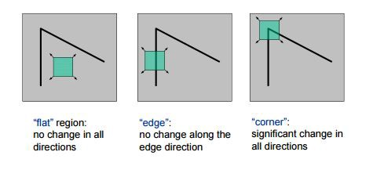

# 1- What ’re the methods that you used ?

   - **OpenCV**
        - imread()
        - cvtColor()
        - goodFeaturesToTrack()
        - circle()
        - Canny()
        - VideoCapture()
        - isOpened()
        - read() 
        - waitKey()
        - release()
        - destroyAllWindows() 
        - cornerHarris()
        - dilate()
           
   - **matplotlib**
        - pyplot.imshow()   
        - pyplot.set_title()
        - pyplot.subplots()    
   
   - **numpy**
        - copy()  
        - int0()  
        - ravel()
        - float32()

# 2- Explain each method ..

   1. **Detect corner of an image**
        1. Read our image using openCV imread method
        2. Convert image to grauscale using openCV cvtColor method
        3. Detect corners using openCV goodFeaturesToTrack method by specifying:
           - Grayscale image
           - The number of corners you want to find  
           - The quality level (which is a value between 0-1)
             - It denotes the minimum quality of corner below which everyone is rejected.
           - The minimum Euclidean distance between corners detected.   
        4. Loop through each point detected 
           - put them in 1D array with all the input-array elements
           - Draw circle around each point.
        5. Draw our image with detected corners.
        
   2. **Real-Time Edge Detection**
        1. Capture video from webcam using openCV VideoCapture(0) 
        2. Read the frame using openCV videoCapture.read   
        3. Detect edges using Canny edge detection.
        4. show our frame and edges.
    
   - **Corners**
        - **Corners**
            - Are the important features in the image
            - They are generally termed as interest points which are invariant to translation, rotation, and illumination.
            
            
        - **Harris Corner Detector Algorithm**
            1. Take the grayscale of the original image
            2. Apply a Gaussian filter to smooth out any noise
            3. Apply Sobel operator to find the x and y gradient values for every pixel in the grayscale image
            4. For each pixel p in the grayscale image, consider a 3×3 window around it and compute the corner strength function. Call this its Harris value.
            5. Find all pixels that exceed a certain threshold and are the local maxima within a certain window (to prevent redundant dupes of features)
            6. For each pixel that meets the criteria in 5, compute a feature descriptor.   
            
              
   3. **Corner detection with Harris Corner Detection method**
        1. Read an image using openCV imread
        2. Convert it to grayscale image
        3. Detect corners using openCV cornerHarris method by specifying:
           - source image
           - blockSize
             - Size of the neighborhood to look at (for each pixel value blockSize * blockSize neighbourhood is considered )
           - ksize
             - Size of the Sobel operator.
           - freeParameter 
             - determine which point are consider corner.
             - lower value will produce more corners.
        4. Define a threshold for extracting strong corner using 0.1 * dst.max() 
           - return 0.1 * maximum corner detection value                      
        5. Iterate through all the corners and draw them on the image (if they pass the threshold)
    
   - **Shi-Tomasi Corner Detection**
        1. It determines which windows (small image patches) produce very large variations in intensity when moved in both X and Y directions (i.e. gradients).
           - For a window(W) located at (X, Y) with pixel intensity I(X, Y), formula for Shi-Tomasi Corner Detection is 
             - f(X, Y) = Σ (I(Xk, Yk) - I(Xk + ΔX, Yk + ΔY))2  where (Xk, Yk) ϵ W
        2. With each such window found, a score R is computed.
           - Calculation of f(X, Y) will be really slow. Hence, we use Taylor expansion to simplify the scoring function, R.
             - R = min(λ1, λ2)
             - where **λ1, λ2** are eigenvalues of resultant matrix
        3. After applying a threshold to this score, important corners are selected & marked     
   4. **Corner Detection with Shi-Tomasi Corner Detection**
        1. Read our image using openCV imread method
        2. Convert image to grauscale using openCV cvtColor method
        3. Detect corners using openCV goodFeaturesToTrack method by specifying:
           - Grayscale image
           - The number of corners you want to find  
           - The quality level (which is a value between 0-1)
             - It denotes the minimum quality of corner below which everyone is rejected.
           - The minimum Euclidean distance between corners detected. 
        4. Convert corners values to integer       
        5. Loop through each point detected 
           - put them in 1D array with all the input-array elements
           - Draw circle around each point.
        6. Draw our image with detected corners.  
        
# 3- What’s new for you ?
 
   - Detect corner
   - Shi-Tomasi Corner Detection

# 4- Resources ? 

   - https://pythonprogramming.net/corner-detection-python-opencv-tutorial/
   - https://www.geeksforgeeks.org/numpy-ravel-python/
   - https://opencv-python-tutroals.readthedocs.io/en/latest/py_tutorials/py_feature2d/py_shi_tomasi/py_shi_tomasi.html
   - https://en.wikipedia.org/wiki/Corner_detection
   - https://medium.com/data-breach/introduction-to-harris-corner-detector-32a88850b3f6
   - https://www.geeksforgeeks.org/python-corner-detection-with-shi-tomasi-corner-detection-method-using-opencv/?ref=lbp
   - https://opencv-python-tutroals.readthedocs.io/en/latest/py_tutorials/py_feature2d/py_shi_tomasi/py_shi_tomasi.html
