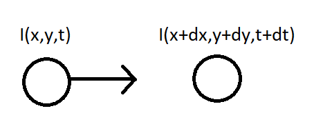
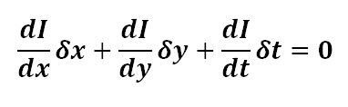
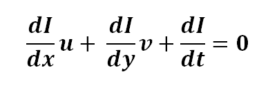

# 1- What ’re the methods that you used ?

   - **OpenCV**
        - imread()
        - cvtColor()
        - goodFeaturesToTrack()
        - circle()
        - Canny()
        - VideoCapture()
        - isOpened()
        - read() 
        - waitKey()
        - release()
        - destroyAllWindows() 
        - calcOpticalFlowPyrLK()
        - line()
        - add()
        - calcOpticalFlowFarneback()
        - cartToPolar()
        - normalize()
        - threshold()
        - findContours()
        - approxPolyDP()
        - drawContours()
        - putText()
        - events
          - EVENT_LBUTTONDOWN
          - EVENT_MOUSEMOVE
          - EVENT_LBUTTONUP
          - namedWindow()
          - setMouseCallback()
        - selectROI()  
        
   - **matplotlib**
        - pyplot.imshow()   
        - pyplot.set_title()
        - pyplot.subplots()    
   
   - **numpy**
        - copy()  
        - int0()  
        - ravel()
        - float32()
        - random.randint()
        - zeros()
        - zeros_like()
        
   - dict()     

# 2- Explain each method ..

   - **Object Tracking**:  
        - Involves recognizing a feature of interest and traking it through sequence of frames.
        - It's used in many applications as:
          1. Facial detection
          2. Surveillance purposes   
          3. Traffic estimation
        - **Object Tracking Challenges**:
            - Rapid movement of object across frames.
            - Changing object orientation
            - Changing illumination
            - Complex feature tracking like facial expressions
            - Interfering background
        - **Object Tracking Methodology**
            1. Use a suitable feature detection algorithm to detect features in an image, that will be tracked as:
               - Harris Corner Detector
               - Shi-Tomasi Corner Detector
            2. Optical Flow computation using **Lucas-Kanade algorithm**         
        
   - **Optical Flow**:
        - Motion of features accross frames due to the relative motion between the scene and the camera.
        - Computing optical flow of an image can help in **Motion Tracking**.
        - Optical flow has many applications as:
          1. Structure from Motion
          2. Video Compression
          3. Video Stabilization
          
        - **Lucas-Kanade Algorithm**
            1. Compute the image x and image y derivatives.
            2. Compute the difference image It = image1 - image2
            3. Smoothen the image components Ix, Iy and It.
            4. Solve the linear equations for each pixel and calculate the **Eigen Values**
            5. Depending on Eigen values obtained, solve the equations using Ctamer's rule.
            6. Plot the optical Flow vectors.
            
        - **Optical Flow Mathematics**:
            1. Consider an object with intensity I (x, y, t), after time dt, it moves to by dx and dy, now, the new intensity would be, I (x+dx, y+dy, t+dt).
              
            2. We, assume that the pixel intensities are constant between the two frames
               - (x, y, t) = I (x+dx, y+dy, t+dt)
            3. Taylor approximation is done on the RHS side, resulting in
                   
            4. On dividing by δt, we obtain the Optical Flow Equation
               
            5. Note that:
               - u = dx/dt
               - v = dy/dt.
               - dI/dx is the image gradient along the horizontal axis.
               - dI/dy is the image gradient along the vertical axis.
               - dI/dt is along the time.     
            

   1. **Optical Flow with Lucas-Kanade method**
        1. Read video using openCV VideoCapture method.
        2. set corner detection parameters using python dict:
           - The number of corners you want to find 
           - The quality level (which is a value between 0-1)
             - It denotes the minimum quality of corner below which everyone is rejected.
           - The minimum Euclidean distance between corners detected.  
           - Size of an average block for computing a derivative covariation matrix over each pixel neighborhood.     
        3. lucas kanade optical flow Parameters using python dict:
           - winSize
             - size of the search window at each pyramid level.
           - maxLevel
             - maximal pyramid level number
               - If set to 0, pyramids are not used (single level)
               - If set to 1, two levels are used  
           - criteria
             - Specifying the termination criteria of the iterative search algorithm
        4. Create some random colors using numpy random.randint
        5. Take first frame, convert it to grayscale and find corners in it.
        6. Create a mask image for drawing purposes using np.zeros_like by specifying old_frame as the shape.
        7. Loop trougth frames 
           1. read frame and convert it to gray
           2. calculate optical flow between old frame and new frame using openCV calcOpticalFlowPyrLK by specifying:
              - prevImg : old_gray
              - nextImg : frame_gray
              - prevPts : p0
              - nextPts : None
              - lucas kanade optical flow Parameters
                - winSize
                - maxLevel
                - criteria
           3. Select good points in p1 and p0 when status = 1 
           4. Loop through old and new points
              1. flatten points in 1D array using ravel method.
              2. draw line between old points and new points to track it
              3. draw circle around new points
           5. show the images          
                
   - **Dense optical flow** 
        - **Dense Optical flow** computes the optical flow vector for every pixel of the frame which may be responsible for its slow speed but leading to a better accurate result.  
        - It can be used for
          - detecting motion in the videos
          - video segmentation
          - learning structure from motion.
          
        - **Difference between sparse and dense optical flow**
            - **sparse techniques** only need to process some pixels from the whole image.
            - **dense techniques**
                - process all the pixels.
                - are slower but can be more accurate
            - Lucas-Kanade accuracy might be enough for real-time applications.
            
        - **The Gunnar-Farneback Method** 
            1. we look at all of the points(unlike Lucas Kanade which works only on corner points detected by Shi-Tomasi Algorithm) 
            2. Detect the pixel intensity changes between the two frames    
            3. Resulting in an image with highlighted pixels, after converting to hsv format for clear visibility.
            4. computes the magnitude and direction of optical flow from an array of the flow vectors
              - (dx/dt, dy/dt)
              
   2. **Dense optical flow**
        1. Read video using openCV VideoCapture method
        2. getting the frame, 
           - first_frame = the first frame in the entire video sequence                    
        3. Converts frame to grayscale because we only need the luminance channel for detecting edges.
        4. Creates an image filled with zero intensities with the same dimensions as the frame using np.zeros_like method.
        5. Sets image saturation to maximum 
        6. Loop through video
           1. getting the frame, frame = the current frame being projected in the video.
           2. Converts each frame to grayscale
           3. Calculates dense optical flow by Farneback using calcOpticalFlowFarneback method by specifying:
              - prev
                - First input image
              - next
                - Second input image  
              - pyr_scale
                - parameter specifying the image scale to build pyramids for each image (scale < 1)
                  - A classic pyramid is of generally 0.5 scale
                  - every new layer added, it is halved to the previous one.   
              - levels
                - number of pyramid layers including the initial image.
                - levels=1 means that no extra layers are created and only the original images are used. 
              - winsize
                - It is the average window size
                  - larger values increase the algorithm robustness to image noise and give more chances for fast motion detection, but yield more blurred motion field. 
              - iterations
                - Number of iterations to be performed at each pyramid level.
              - poly_n
                - It is typically 5 or 7
                - it is the size of the pixel neighbourhood which is used to find polynomial expansion between the pixels.
              - poly_sigma
                - standard deviation of the gaussian that is for derivatives to be smooth as the basis of the polynomial expansion.
                - It can be 1.1 for poly= 5 and 1.5 for poly= 7.
              - flow
                - computed flow image that has similar size as prev and type to be CV_32FC2
              - flags
                - It can be a combination of:
                  - **OPTFLOW_USE_INITIAL_FLOW** uses input flow as initial apporximation.
                  - **OPTFLOW_FARNEBACK_GAUSSIAN** uses gaussian winsize*winsize filter.            
           4. Computes the magnitude and angle of the 2D vectors using openCV cartToPolar method
           5. Sets image hue according to the optical flow direction.
           6. Sets image value according to the optical flow magnitude (normalized) using openCV normalize method 
           7. Converts HSV to RGB (BGR) color representation
           8. Show the images   
           
   3. **Visualizing image in different color spaces**
        - **RGB Image**
            - Is represented by linear combination of 3 different channels which are:
              - **R**: Red
              - **G**: Green
              - **B**: Blue   
        - **Gray Scale Image** 
            - Grayscale image contains only single channel.
            - Pixel intensities in this color space is represented by values ranging from 0 to 255.       
        - **YCrCb Color Space**
            - **Y**: represents Luminance or Luma component
            - **Cb**: represents the blue-difference (difference of blue component and Luma Component).
            - **Cr**: represents the red-difference (difference of red component and Luma Component).  
        - **HSV color space**
            - **H**: Hue represents dominant wavelength.
            - **S**: Saturation represents shades of color.
            - **V**: Value represents Intensity.
        - **LAB color space**
            - **L**: Represents Lightness.
            - **A**: Color component ranging from Green to Magenta.
            - **B**: Color component ranging from Blue to Yellow.
        - **Edge map of image**
            - Edge map can be obtained by various filters like
              - laplacian
              - sobel
              - Canny
        - **Heat map of image**
            - Heat map representation, individual values contained in a matrix are represented as colors.
        - **Spectral Image map**
            - Obtains the spectrum for each pixel in the image of a scene.

   - **Contours** 
        - **Contours**:
            - are defined as the line joining all the points along the boundary of an image that are having the same intensity.
            - Contours Using in 
              1. Shape analysis
              2. Finding the size of the object of interest, and 
              3. Object detection.                            

   4. **Find Co-ordinates of Contours** 
        1. assign font type using FONT_HERSHEY_COMPLEX 
        2. read image and convert ot to rgb and gray scale 
        3. use grayscale image to apply threshold using openCV threshold method by specigying:
           - our gray iamge
           - threshold value, any pixel under that threshold will be excluded
           - maxvalue of threshold
           - threshold type which is THRESH_BINARY
        4. find contours using openCV findContours method by specifying:
           - resulted threshold image
           - Contour retrieval mode which is RETR_TREE
             - **RETR_TREE**: retrieves all of the contours and reconstructs a full hierarchy of nested contours.
           - Contour approximation method which is CHAIN_APPROX_SIMPLE
             - **CHAIN_APPROX_SIMPLE**
                 - compresses horizontal, vertical, and diagonal segments and leaves only their end points.
                 - For example, an up-right rectangular contour is encoded with 4 points. 
           - findContours method return:
             - image:
               - Source image
             - contours:
               - Detected contours. Each contour is stored as a vector of points 
             - hierarchy:
               - Optional output vector containing information about the image topology.
               - It has as many elements as the number of contours    
        5. Going through every contours found in the image.
           - Approximates a polygonal curve with the specified precision using openCV approxPolyDP by specifying:
             - curve
               - Input vector of a 2D point stored in contours.
             - epsilon
               - Parameter specifying the approximation accuracy.
               - This is the maximum distance between the original curve and its approximation. 
             - closed
               - If true, the approximated curve is closed (its first and last vertices are connected).
               - Otherwise, it is not closed.    
             - approxPolyDP return 
               - approxCurve
                 - Result of the approximation. 
                 - The type should match the type of the input curve.
           - draws boundary of contours using drawContours by specifying:
             - Image to draw contours on it
             - our approximation list resulted from approxPolyDP method
             - contourIdx 
               - which is a parameter indicating a contour to draw.
               - If it is negative, all the contours are drawn.    
             - color
               - Color of the contours.  
             - thickness
               - Thickness of lines the contours are drawn with.
               - If it is negative (for example, thickness=FILLED ), the contour interiors are drawn.
           - Loop through flatted the array containing the co-ordinates of the vertices.    
             - to put text on topmost co-ordinate.
             - put co-ordinates(x, y) as text
        6. Then draw images   
        
   5. **Find and Draw Contours**
        1. Read image and convert it to grayscale
        2. make a copy of the image to draw contoures on it
        3. reate a binary thresholded image 
        4. Finding Contours using openCV findContours method
        5. print the number of contours founded
        6. draw the contours founded using openCV drawContours method
        7. Show images   
 
   6. **1. Draw a rectangular shape and extract objects**
        1. Create a balck image to draw react on it using np.zeros method
        2. define a function that draw according to mouse move 
           1. Indicates that the left mouse button is pressed using cv2.EVENT_LBUTTONDOWN
              - Change the drawing indictor to true
              - put the new (x,y) value in (ix,iy)
           2. Indicates that the mouse pointer has moved over the window using cv.EVENT_MOUSEMOVE
              - Check if darwing flag is true, then mouse is pressed  
                - Then check if mode is true, then draw rectangle 
                  - draw a rectangle using openCV rectangle method by specifying
                    - image to darw on it
                    - point one which is (ix,iy)
                    - point two which is (x,y)
                    - color
                    - line thickness 
                - Check if mode is false, then draw a circle 
                  - Draw a filled circle          
           3. Indicates that left mouse button is released using cv2.EVENT_LBUTTONUP.
              - Change drawing flag to false
              - Check if mode is true
                - Then draw recatangle using (ix,iy), (x,y) points
              - if mode is flase
                - Then draw a circle around (x,y)  
        3. Then Show images
        
   6. **2. Draw a rectangular shape around ROI and crop that ROI**
        1. Read image using OpenCV imread
        2. Convert it to RGB
        3. Select ROI using openCV selectROI method by specifying the image we want to crop ROI from it
        4. Create the croped region from the original image by specifying it's height and width
        5. Draw our images
             
   7. **cv2.rectangle() method**
        - Syntax: cv2.rectangle(image, start_point, end_point, color, thickness)
        1. Read image using openCV imread method
        2. Convert image from BGR to RGB using openCV cvtColor
        3. Specify rectangle method parameters as
           - start_point = (170, 10) 
           - end_point = (450, 320) 
           - color = (255, 0, 0) 
           - thickness = 2 
             - note that: thickness = -1 will fill the rectangle shape by the specified color. 
        4. Show original image and rectangle image.         
   
   8. **cv2.putText() method**
        - Syntax: cv2.putText(image, text, org, font, fontScale, color, thickness, lineType, bottomLeftOrigin) 
        1. Read image using openCV imread method
        2. Convert image from BGR to RGB using openCV cvtColor
        3. Specify rectangle method parameters as
           - org = (50, 160)
             -  It is the coordinates of the bottom-left corner of the text string in the image 
           - fontScale = 1
             - Is multiplied by the font-specific base size.
           - color = (255, 0, 0) 
           - thickness = 2 
        4. Show original image and rectangle image.         
   
                          
# 3- What’s new for you ?

   - optical flow with lucas kanade method
   - Dense optical flow - The Gunnar-Farneback Algorithm
   - Draw a rectangular shape and extract objects

# 4- Resources ? 

   - https://www.youtube.com/watch?v=1r8E9uAcn4E
   - https://www.geeksforgeeks.org/python-opencv-optical-flow-with-lucas-kanade-method/?ref=lbp
   - https://opencv-python-tutroals.readthedocs.io/en/latest/py_tutorials/py_video/py_lucas_kanade/py_lucas_kanade.html
   - https://docs.opencv.org/master/dd/d1a/group__imgproc__feature.html#ga1d6bb77486c8f92d79c8793ad995d541
   - https://docs.opencv.org/master/dc/d6b/group__video__track.html#ga473e4b886d0bcc6b65831eb88ed93323
   - https://numpy.org/doc/stable/reference/generated/numpy.zeros_like.html
   - https://stackoverflow.com/questions/11037136/what-is-the-difference-between-sparse-and-dense-optical-flow
   - https://www.geeksforgeeks.org/opencv-the-gunnar-farneback-optical-flow/
   - https://docs.opencv.org/3.4/dc/d6b/group__video__track.html#ga5d10ebbd59fe09c5f650289ec0ece5af
   - https://docs.opencv.org/3.4/d2/de8/group__core__array.html#gac5f92f48ec32cacf5275969c33ee837d
   - https://docs.opencv.org/3.4/d2/de8/group__core__array.html#ga87eef7ee3970f86906d69a92cbf064bd
   - https://www.geeksforgeeks.org/python-visualizing-image-in-different-color-spaces/?ref=lbp
   - https://www.learnopencv.com/color-spaces-in-opencv-cpp-python/
   - https://www.geeksforgeeks.org/find-co-ordinates-of-contours-using-opencv-python/?ref=lbp
   - https://docs.opencv.org/3.4/d3/dc0/group__imgproc__shape.html#ga17ed9f5d79ae97bd4c7cf18403e1689a
   - https://docs.opencv.org/3.4/d3/dc0/group__imgproc__shape.html#ga819779b9857cc2f8601e6526a3a5bc71
   - https://docs.opencv.org/3.4/d3/dc0/group__imgproc__shape.html#ga4303f45752694956374734a03c54d5ff
   - https://docs.opencv.org/3.4/d3/dc0/group__imgproc__shape.html#ga0012a5fdaea70b8a9970165d98722b4c
   - https://en.wikipedia.org/wiki/Ramer%E2%80%93Douglas%E2%80%93Peucker_algorithm
   - https://docs.opencv.org/3.4/d0/de1/group__core.html#gaf076ef45de481ac96e0ab3dc2c29a777
   - https://docs.opencv.org/3.4/d7/dfc/group__highgui.html#gga927593befdddc7e7013602bca9b079b0ad3419100fc2d7688c6dbe3da030fbfd9
   - https://www.geeksforgeeks.org/python-opencv-cv2-rectangle-method/?ref=lbp
   - https://www.geeksforgeeks.org/python-opencv-cv2-puttext-method/?ref=lbp
   - https://docs.opencv.org/3.4/d7/dfc/group__highgui.html#ga89e7806b0a616f6f1d502bd8c183ad3e
   - https://www.learnopencv.com/how-to-select-a-bounding-box-roi-in-opencv-cpp-python/
   - https://docs.opencv.org/3.4/d7/dfc/group__highgui.html#ga0f11fad74a6432b8055fb21621a0f893
   
   
   
   
   
   
   
   
   
   
   
