# 1- Summary if Videos ..

   - **Supervised Machine Learning**
        - **Feature representation**
            - taking an object of dataset and converting it into numbers that the computer can understand.
            - each column in the dataset corresponds to a different feature that associated with each instance.
            - each row in the dataset corresponds to one specific data instance per sample
            - In Python, we put all features in capital X, and it will be the inputs for our classifier
            
            - **Label**
                - each instance has a label
                - label is the target value
                - In classification, the target value is label of an object
                - In regression, it's the continuous value you want to predict from the inputs.
                - In python, we use lower case y to hold the target values.
            - We split the dataset to trainset which is by default 0.75 and testset which is by deafault 0.25 
              - use train_test_split method from sklearn.model_selection
              
            - **Model procedures** 
                1. Preprocess the data
                   - scaling
                   - normalization
                   - cleaning
                2. Splitting the date to train and test set
                3. fitting the model with trainset data
                4. extract trained model after fitting
                5. evaluation methods
                   - how well the model actually does on the test set 
                   
        - **Classification**: Target value is discrete        
            1. binary classification
               - has two types of target values
                 - 0 (NO) represent the negative class
                 - 1 (YES) represent the positive class    
            2. Multi-class classification
               - The target value is more than 1 amd 0 
            3. Multi label classification
               - classification with multiple target values    
                    
        - **Regression**: Target value is continuous
            - ex: predicting the selling price of a house.
           
        - The relationship between model complexity and training/test performance
          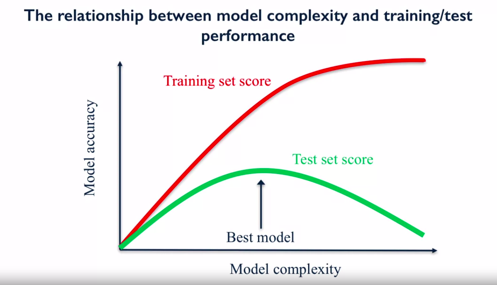
          - when the model complexity increases, the model is overfitting
        
        - Input variables (features) are called independent variables. 
        - Outcome variables (traget values or label) are called dependent varaibles.    
        
        - **Generalization**
            - Refers to an algorithm's ability to give accurate predictions for new, unseen data.
            - Future unseen data (test data) will have the same properties as the training data.
            - The more complex the model, the more overfitting which lead the model to not likely to generalize well to new data.
            - The mode simple the model, the more underfitting which lead the model to not likely to generalize well to new data       
            - **Induction**: 
                - refers to learning general concepts from specific examples    
            - **Deduction**: 
                - seeks to learn specific concepts from general rules.
            
            - **Overfitting**
                - Good performance on the training data, poor generliazation to other data.
                - The model learns the detail and noise in the training data to the extent that it negatively impacts the performance of the model on new data. 
                
            - **Underfitting**
                -  Poor performance on the training data and poor generalization to other data.   
                
            - There are two important techniques that you can use when evaluating machine learning algorithms to limit overfitting:
              1. Use a resampling technique to estimate model accuracy as **k-fold cross validation**.
              2. Use a validation dataset.
              
        - **The K-Nearest Neighbor (K-NN) Classifier Algorithm**
            - To predict a label for new data instance 
              1. Find the most similar instances in training data to the new data instance 
              2. Get the labels for the similar instances in training data.
              3. predict the label for the new instance by combining the labels of similar instances in training data using **simple majority vote**.
            - Using K-NN in regression problems
              - We don't have class values as target, we have continuous values
              - So, instead of taking a majority vote, we can average these three target values, and taje the average value as the traget value for the query point.
              - We measures how well a prediction model for regression fits the given data using R^2 (r-squared) regression score.
                - The score is between 0 and 1 
                  - **0** corresponds to a constan model that predicts the mean value of all training target values.
                  - **1** corresponds to perfect prediction
                  - The r-squared value is sometimes known as **coefficient of determination**.   
                - When K is increase, the complexity of the model is decrease which lead to less overfitting and more generalization
                  - The training accuracy goes down, and test accuracy goes up. 
            - When data is sparse, it's recommended not to use K-NN.
              - **Sparse data** mean that each instance has lots of features bu most of them are zero. 
            - When training data has a lot of instances and features, it's recommended not to use K-NN
            - K-NN model parameters:
              - n_neighbors: number of nearest neighbors K 
              - metric: distance func between data points  
           
        - **Feature Normalization**
            - Important for a lot of machine learning algorithms
            - one of the most common technique is MinMax scaling.
              - Scale between zero and one
            - Fit the scaler using the training set, then apply the same scaler to transform the test set.       
            
        - **The Bias vs Variance trade-off**
            - **Bias**
                - Refers to the error due to the model’s simplistic assumptions in fitting the data.
                - A high bias means that the model is unable to capture the patterns in the data and this results in under-fitting.
            - **Variance**
                - Refers to the error due to the complex model trying to fit the data.
                - High variance means the model passes through most of the data points and it results in over-fitting the data.       
                   
        - **Linear Models**
        
            - Is kind of supervised learning
            - Is a sum of weighted variables that predicts a target output value given an input data instance
            
            1. **Linear Regression**
                 - has many features x = (x0, x1, ... , xn) 
                   - x is feature vector
                 - Predicted output Ŷ = ŵ0x0 + ŵ1x1 + ... + ŵnxn + b̂ 
                 - parameters to estimate
                   - Ŵ = (Ŵ0, Ŵ1, .. , Ŵn) feature weights or model coefficients
                   - b̂ = constant bias term or intercept
                 - **Least-squares Linear Regression (Ordinary Least-squares)**
                     - Finds w and b that minimizes the mean squared error of the model (**Residual sum of squares RSS**)
                       - The sum of squared differences between predicted target and actual target values.
                     - No parameters to control model complexity
                    
            - For data with many features, linear model can be very effactive and generalize well to new data.
            -  The learning algorithm finds the parameters that optimize an objective function, minimize some kind of loss function of the predicted values vs actual target values.   
            - In Scikit-Learn, object attribute ends with an underdcore, this means that these attributes were derived from training data
            
            2. **Ridge Regression**
                 - use the same least-squares criterion but adds a penalty for feature weights (regularization).
                 - **Regularization**
                     - Prevents overfitting by restricted the model to reduce it's complexity
                 - ridge regression uses **L2 regularization**
                   - minimize sum of squares of w entries.    
                 
            3. **Lasso Regression**    
                 - Is another form of regularized linear regression that uses L1 regularization penalty for training instead of redge's L2 penalty.
                 - **L1 regularization**
                     - Minimize the sum of absolute values of the coefficients.
            
            4. **Polynomial Linear Regression**
                 - The general equation of a polynomial regression is: 
                   - Y = θo + θ₁X + θ₂X² + … + θₘXᵐ + residual error
                 - Advantages of using Polynomial Regression:
                   1. Polynomial provides the best approximation of the relationship between the dependent and independent variable.
                   2. A Broad range of function can be fit under it.
                   3. Polynomial basically fits a wide range of curvature.      
         
            5. **Logistic Regression**
                 - Is a supervised learning classification algorithm used to predict the probability of a target variable.
                 - logistic regression is the same as linear regression but with more addition:
                   - It still compute the weighted sum of the input features but it runs the result through a special non-linear function f, the logistic function  
                 - **The logistic function (the Sigmoid Function)** 
                     - In order to map predicted values to probabilities, we use the Sigmoid function.
                     - The function maps any real value into another value between 0 (negative class) and 1 (positive class).
                     - In machine learning, we use sigmoid to map predictions to probabilities.    
                      
            6. **Support Vector Machine SVM**
                 - The objective of the SVM algorithm is to find a hyperplane in an N-dimensional space(N — the number of features) that distinctly classifies the data points.    
                    
                 
                 - Objective is to find a plane that has the maximum margin, i.e the maximum distance between data points of both classes.
                   - Maximizing the margin distance provides some reinforcement so that future data points can be classified with more confidence.
                 - **The Margin**
                     - Is the distance the width that we can go from the decision boundary perpendicular to the nearest data point.  
                 - **Mllti-class classification**
                     - It converts a multiclass classification problem into a series of binary problems.
                       - for each class has to be predicted, it creates one binary classifier that predicts that class against all the other classes
                     - It will go through each of binary classifiers in turn and predict the class whose classifier has the highest score.
                  
                 - **Kernelized Support Vector Machines**
                     1. take the original input data space and transform it to a new higher dimensional feature space.
                        ex. transform data point dimensions from 1D Xi to 2D dimension (Xi, Xi^2)
                     2. Then bring the data back to it's original sapce by taking it's inverse.       
                     - Kernelized Support Vector Machines tries to find the decision boundary with maximum margin between classes using a linear classifier in the transformed feature space not the original input space.
                     
                     - **Different kernels** 
                         - Radial basis function (RBF) kernel
                           1.  Gaussian radial basis function (RBF)
                               - It is a general-purpose kernel; used when there is no prior knowledge about the data.
                                 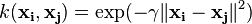
                           2. Laplace RBF kernel
                              - It is general-purpose kernel; used when there is no prior knowledge about the data.
                                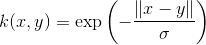   
                         - Polynomial kernel
                           - It is popular in image processing.
                             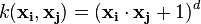
                         - Linear splines kernel in one-dimension
                           - It is useful when dealing with large sparse data vectors.
                           - It is often used in text categorization.
                           - The splines kernel also performs well in regression problems.
                             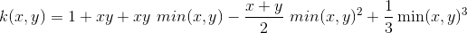 
                         - sigmoid kernel
                           - We can use it as the proxy for neural networks.
                             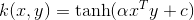
                         - Gaussian kernel
                           - It is a general-purpose kernel; used when there is no prior knowledge about the data.
                             
                         - ANOVA radial basis kernel
                           - We can use it in regression problems.  
                             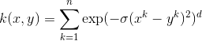 
                          
                     - **Important parameters**
                         1. kernel
                            - Type of kernel function to bes used
                            - Default is **rbf** for radial basis function
                            - Other types include **polynomial**
                         2. kernel parameters
                            - gamma
                              - RBF kernel width
                         3. C
                            - regulariztion parameter
                         4. Typically C and gamma are tuned at the same time.              
            
            7. **Decision Tress**
                 - It's a supervised learning algorithm using for both classification and regression.
                 - It uses IF-Then rules on features.
                 - Decision Tree uses **information gain** to best split the data
                 - **How to build Decision Tree**
                     1.compute the entropy for data-set
                     2.for every attribute/feature:
                       1.calculate entropy for all categorical values
                       2.take average information entropy for the current attribute
                       3.calculate gain for the current attribute
                     3. pick the highest gain attribute.
                     4. Repeat until we get the tree we desired.
                   
                     - **Entropy**
                         - Is the measures of impurity, disorder or uncertainty in a bunch of examples.
                           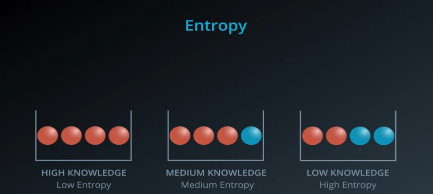 
                           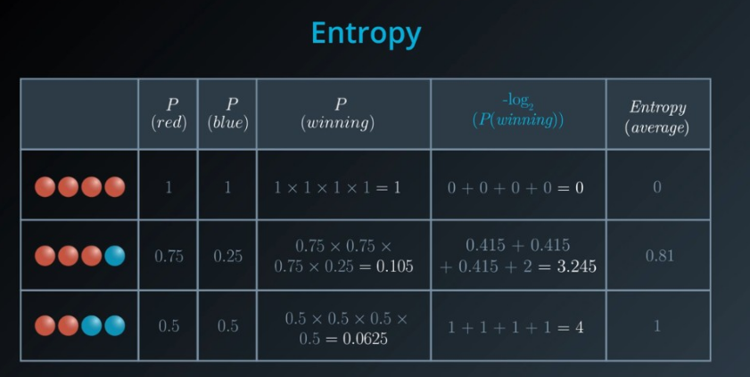 
                           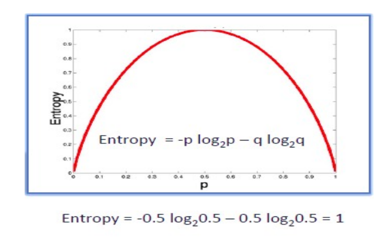 
                     - **Information Gain**
                         - The information gain is based on the ecrease in entropy after a dataset is split on an attribute.
                           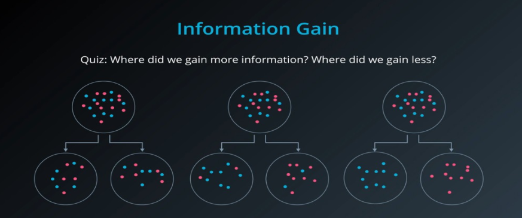             
                 - DecisionTreeClassifier parameters
                   - max_depth
                     - Controls maximum depth (number of split points).
                     - Most common way to reduce tree complexity and overfitting.
                   - min_samples_leaf
                     - threshold for minimum number of data instances a leaf can have to avoid further splitting.
                   - max_leaf_nodes
                     - limits total number of leaves in the tree.
       
        - **Cross-validation**
            - Is a resampling procedure used to evaluate machine learning models on a limited data sample   
            - **k-Fold Cross-Validation**
                - k refers to the number of groups that a given data sample is to be split into.
            - The general procedure is as follows:
              1. Shuffle the dataset randomly.
              2. Split the dataset into k groups
              3. For each unique group:
                 1. Take the group as a hold out or test data set
                 2. Take the remaining groups as a training data set
                 3. Fit a model on the training set and evaluate it on the test set
                 4. Retain the evaluation score and discard the model
              4. Summarize the skill of the model using the sample of model evaluation scores    
            
            
# 2- What’s new for you ?

   - Ridge Regression and Lasso Regression

# 3- Resources ? 

   - https://numpy.org/doc/stable/reference/generated/numpy.set_printoptions.html
   - http://library.isr.ist.utl.pt/docs/numpy/reference/generated/numpy.set_printoptions.html
   - https://stackoverflow.com/questions/2891790/how-to-pretty-print-a-numpy-array-without-scientific-notation-and-with-given-pre
   - https://scikit-learn.org/stable/modules/generated/sklearn.preprocessing.MinMaxScaler.html
   - https://www.kaggle.com/questions-and-answers/58368
   - https://machinelearningmastery.com/overfitting-and-underfitting-with-machine-learning-algorithms/
   - https://www.geeksforgeeks.org/underfitting-and-overfitting-in-machine-learning/
   - https://towardsdatascience.com/what-are-overfitting-and-underfitting-in-machine-learning-a96b30864690
   - https://www.statisticshowto.com/ridge-regression/#:~:text=Ridge%20regression%20is%20a%20way,(correlations%20between%20predictor%20variables).
   - https://ncss-wpengine.netdna-ssl.com/wp-content/themes/ncss/pdf/Procedures/NCSS/Ridge_Regression.pdf
   - https://towardsdatascience.com/ridge-regression-for-better-usage-2f19b3a202db
   - https://www.youtube.com/watch?v=Qa2APhWjQPc
   - https://towardsdatascience.com/introduction-to-linear-regression-and-polynomial-regression-f8adc96f31cb
   - https://towardsdatascience.com/polynomial-regression-bbe8b9d97491
   - https://www.tutorialspoint.com/machine_learning_with_python/machine_learning_with_python_classification_algorithms_logistic_regression.htm#:~:text=Logistic%20regression%20is%20a%20supervised,be%20only%20two%20possible%20classes.&text=Mathematically%2C%20a%20logistic%20regression%20model,as%20a%20function%20of%20X.
   - https://kambria.io/blog/logistic-regression-for-machine-learning/
   - https://towardsdatascience.com/support-vector-machine-introduction-to-machine-learning-algorithms-934a444fca47
   - https://towardsdatascience.com/support-vector-machine-introduction-to-machine-learning-algorithms-934a444fca47
   - https://medium.com/@james_52456/why-kernelized-support-vector-machine-svm-is-mls-most-beautiful-algorithm-183887accdd2
   - https://towardsdatascience.com/svm-and-kernel-svm-fed02bef1200
   - https://data-flair.training/blogs/svm-kernel-functions/
   - https://machinelearningmastery.com/k-fold-cross-validation/#:~:text=Cross%2Dvalidation%20is%20a%20resampling,k%2Dfold%20cross%2Dvalidation.
   - https://homes.cs.washington.edu/~pedrod/papers/cacm12.pdf
   - https://www.the-scientist.com/news-opinion/genetic-test-for-autism-refuted-38511
   - https://www.geeksforgeeks.org/decision-tree/
   - https://www.sciencedirect.com/topics/computer-science/decision-tree-classifier
   - https://medium.com/@aaaanchakure/decision-tree-classification-de64fc4d5aac
