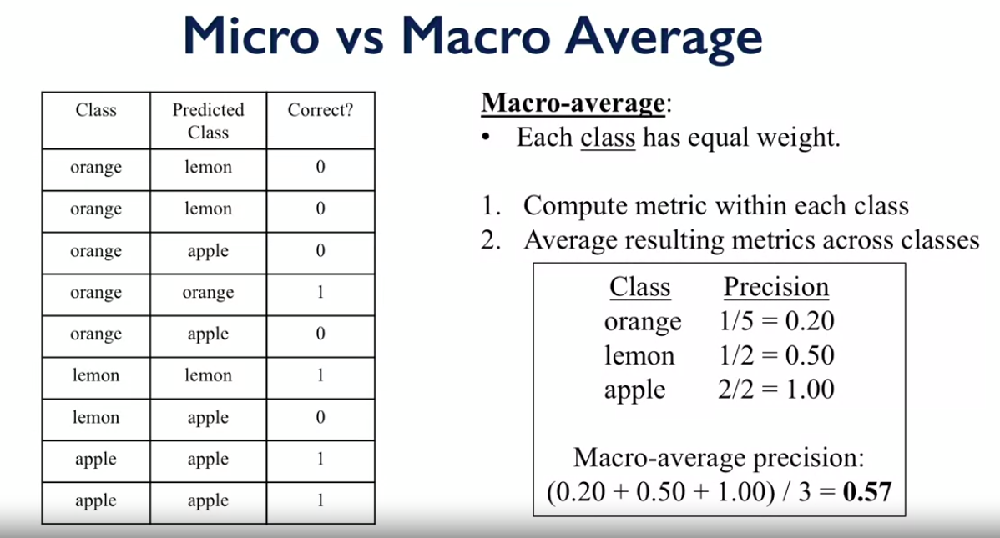

# 1- Summary if Videos ..
  
   - **Model Evaluation & Selection**
  
        - **Accuracy**
            - Is the fraction of samples that were classified correctly where the classifier predicted label matched the correct actual label.  
            - It only gives apartial picture of classifier's performance.
            - Accuracy = number of predictions / number of total instances
            
            - **Evaluation**
                - Different applications have very different goals
                - Accuracy is widely used, but many others are possible.
                  - in medical and health applications, we wnat the classifier to reduce **false negative** predictions, accuracy not enough for that. 
                  
            - **Imbalanced data** 
                - Refers to a classification problem where the number of observations per class is not equally distributed
                  - often you'll have a large amount of data/observations for one class (referred to as the majority class)
                  - and much fewer observations for one or more other classes (referred to as the minority classes)  
                  - Accuracy metric not good with imblance data as performance measure for our model.   
                
            - **Dummy Classifier**
                - The classifier’s behavior is completely independent of the training data as the trends in the training data are completely ignored and instead uses one of the strategies to predict the class label.
                - Does not generate any insight about the data and classifies the given data using only simple rules. 
                - Serve as sanity check on your classifier's performance0
                - Provide a null metric (null accuracy) baseline.
                - Should not be used for real problems.   
                - It is especially useful for datasets where are sure of a class imbalance. 
                - **Strategies used by the dummy classifier to predict a class label**
                    1. Most Frequent
                       - The classifier always predicts the most frequent class label in the training data.
                    2. Stratified
                       - It generates predictions by respecting the class distribution of the training data.
                       - It is different from the “most frequent” strategy as it instead associates a probability with each data point of being the most frequent class label.  
                    3. Uniform
                       - It generates predictions uniformly at random.
                    4. Constant
                       - The classifier always predicts a constant label and is primarily used when classifying non-majority class labels.    
                
            - If our classifier accuracy is close to the null accuracy baseline, it could be a sign of 
              1. Ineffective, erroneous or missing features
              2. Poor choice of kernel or hyperparameter
              3. Large class imbalance    
              
            - **Dummy Regressors**
                - strategy parameter 
                  1. mean
                     - predicts the mean of the training targets
                  2. median
                     - predicts the nedian of the training target
                  3. quantile
                     - predicts a user-provided quantile of the training targets.
                  4. constant
                     - predicts a constant user-provided value.        
                     
        - **Confusion Matrix (error matrix)**
            - Is a specific table layout that allows visualization of the performance of an algorithm
              - In unsupervised learning it is usually called a matching matrix
            - Each row of the matrix represents the instances in a predicted class while each column represents the instances in an actual class (or vice versa). 
                
              
              - **Accuracy** 
                  - TP + TN / Total
                  
              - **Classification error** 
                  - 1 - Accuracy
                  - FP + FN / Total
                  
              - **Recall**
                  - True Positive Rate (TPR), Sensitivity, Probability of detection
                  - TP / TP + FN
                  - Used in
                    - Search and information extraction in legal discovery.
                    - Medical field as Tumor detection
                    - Often paired with a humun expert to filter out false positive.
                    
              - **Precision**
                  - False Positive Rate (FRP), Specificity
                  - TP / TP + FP
                  - Gives us the fraction of all negative instances that the classifier incorrectly identifies as positive.
                  - Used in
                    - Search engine ranking, query suggestion
                    - Document classification
                    
              - Icreasing the **recall** will decrese the **precision** and vice versa.        
              
                - **Fβ-score** 
                    - (1+β) * precision * recall / (β^2 * precision) + recall
                    - (1+β^2) * TP / (1+β^2) * TP + β * FN + FP 
                
                    - **F1-score**
                        - Combining precision and recall into a single number
                        - Is the harmonic mean of precision and recall
                        - β = 1
                        - 2 * precision * recall / precision + recall
                        - 2 * TP / 2 * TP + FN + FP    
                                              
              - **Precision-Recall Curves**
                  - are widely used evaluation method from ml 
                  - Optimal point of classifier would be 1.0 of precision and 1.0 of recall.
               
              - **ROC Curves**
                  - Receiver Operating Characteristic curves
                  - are widely used visualization method to illustrate the performance of classififer 
                    - ROC curve on X-axis show a classifier's False Positive Rate from 0 to 1
                    - on the Y-axis shows a classifier's True positive Rate from 0 to 1
                  - Ideal point of ROC curve is 
                    - False positive rate = 0
                    - True positive rate = 1 
                  - We aim to make our classifier
                    - Maximize the true positive rate
                    - Minimizing the false positive rate.
                  - Area Under Curve **AUC**
                    - a single number measures the total area underneath the ROC curve
                      - AUC of 0 represent a bad classifier
                      - AUC of 1 represent a good classifier    
              
              - **Multi-class Evaluation**
                  - A collection of true vs oredicted binary outcomes, one per class 
                      
                  - **Macro Average Precision**  
                        
                  - **Micro Average Precision** 
                        
                  - **Macro Average vs Micro Average usage** 
                       
                      
              - **Regression Evaluation Metrics**
                  - **r2_score**
                      - computes how well future instances will be predicted
                      - Best possible score is 1.0
                      - Constant prediction score is 0.0 
                  - Other metrics
                    - **mean_absolute_error**
                        - absolute difference between target and predicted.
                        - L1 norm loss
                        - sometimes used in regression in time series analysis. 
                    - **mean_squared_error**
                        - squared difference between target and predicted.
                        - L2 norm loss 
                    - **meadian_absolute_error**
                        - rubost to outliers                

# 3- What’s new for you ?

   - Dummy Classification 
   - Dummy Regression
   - Macro Average Precision
   - Micro Average Precision

# 4- Resources ? 

   - https://www.jeremyjordan.me/imbalanced-data/#:~:text=Imbalanced%20data%20typically%20refers%20to,classes%20(referred%20to%20as%20the
   - https://towardsdatascience.com/methods-for-dealing-with-imbalanced-data-5b761be45a18
   - https://www.geeksforgeeks.org/ml-dummy-classifiers-using-sklearn/
   - https://stackoverflow.com/questions/29441943/what-is-the-theorical-foundation-for-scikit-learn-dummy-classifier
   - https://www.sagepub.com/sites/default/files/upm-binaries/21120_Chapter_7.pdf
   - https://en.wikipedia.org/wiki/Confusion_matrix
   - https://towardsdatascience.com/multi-class-metrics-made-simple-part-i-precision-and-recall-9250280bddc2
   - https://sebastianraschka.com/faq/docs/multiclass-metric.html
   - https://ai.stanford.edu/~ronnyk/2007GuideControlledExperiments.pdf
   - https://scikit-learn.org/stable/modules/generated/sklearn.svm.SVC.html
   - https://scikit-learn.org/stable/modules/generated/sklearn.model_selection.cross_val_score.html
   - https://www.datacamp.com/community/tutorials/svm-classification-scikit-learn-python
