# 1- Summary if Videos ..

   - **Naive Bayes Classifiers**
        - These classifiers are called **Naive** because
          - They assume that features are conditionally independent, given the class.
          - For all instances of a given class, the features have little/no correlation with each other.
          - Generalization performance may worse than other ml methods.  
          
          - **Naive Bayes Classifier Type**
              1. Bernoulli
                 - binary features as word presence or absence
              2. Multonomial
                 - Discrete features as word count
              3. Gaussian
                 - Continuous or real-valued features
                 - Statistics computed for each class 
                 
              - **Gaussian Naive Bayes Classifier**
                  - Is used for high-dimensional data 
                  - Assume that features are continuous or real-valued features     
                  - Assume that the data for each class was generated by a simple class specific gaussian distribution.
                  - In Training
                    - The gaussian NB classifier estimates for each feature the mean and standard deviation of the feature value for each class.
                  - In Prediction
                    - The classifier compares the features of the example data point to be predicted with feature statistics for each class and selects the class that best matches the data point.       
              
   - **Random Forest** 
        - It's an ensemble method of decision trees
        - USed for Classification and regression
        - It does not require normaliztion aor feature scalling.
        - RF is not a good choice for a very high dimensional data.
        - In Sklearn.ensemble 
          - Classificatio: ReandomForestClassifier
          - Regression: RandomForestRegressor
        - One decision tree
          - Prone to overfitting
        - Many decision trees (Random Forest)
          - More stable, better generalization
        - To create a random forest model
          - first, decide how many trees to build (n_estimated parameter)
          - each tree were built from a different sample of the data called the bootstrap sample
          - **Bootstrap sample**
              - used in statistics and ml
              - If the training set has N instances or sample in total.
              1. a bootstrap sample of size N is created by just repeatedly piking one of the N dataset rows ar random with replacement.
              2. That is allowing for possibility of picking the same row again at each selection
              3. repeat this random selection process N times.  
                 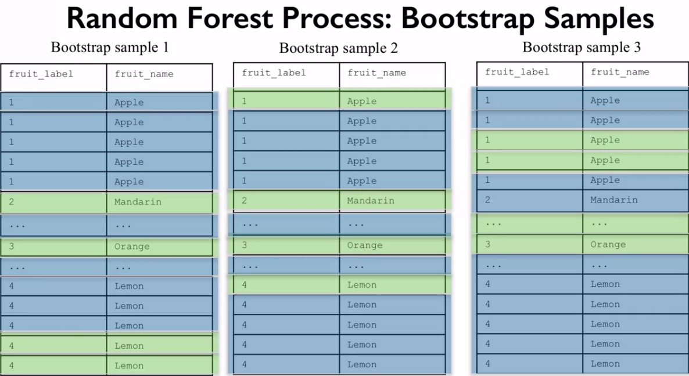 
                         
          - **Random Forest Process** 
              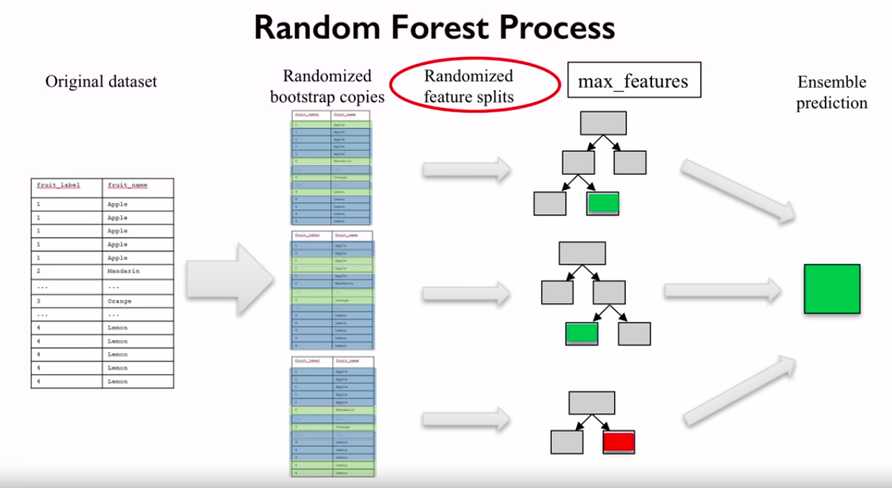 
                    
             - max_features parameter
               - setting max_features to 1 leads to forest with diverse, more complex trees
               - setting max_features to <close to number of features> will lead to similar forests with simpler trees.
                  
             - **Random Forest Prediction** 
                 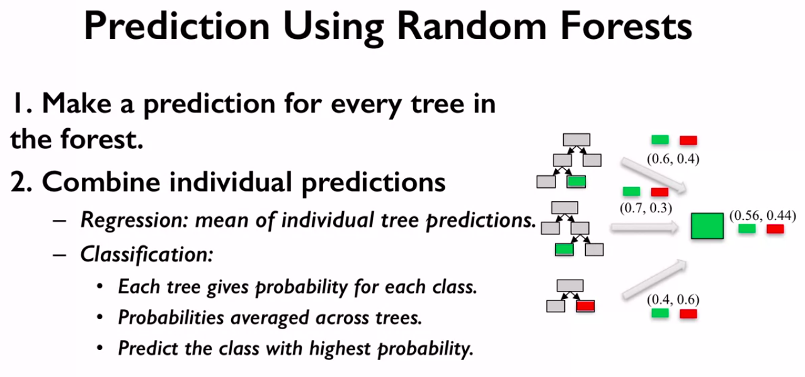 
                    
             - **RF Parameters** 
                 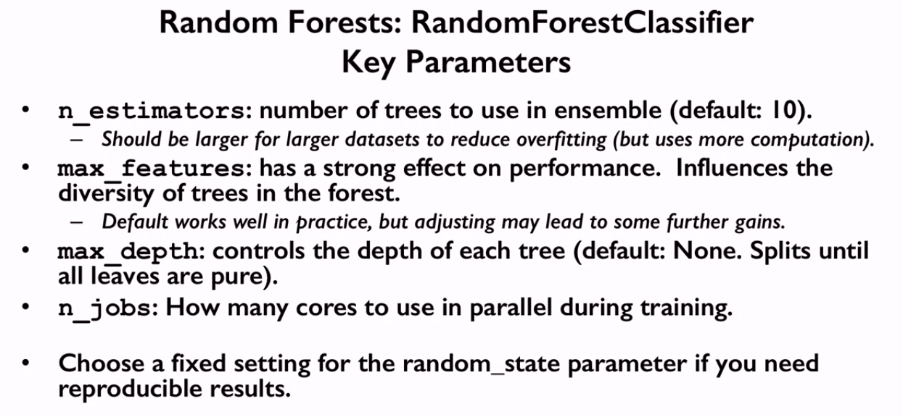
                
   - **Gradient Boosted Decision Trees**   
        - Build a series of trees, where each tree is trained that it attempts to correct the mistakes of the previous tree in the series. 
          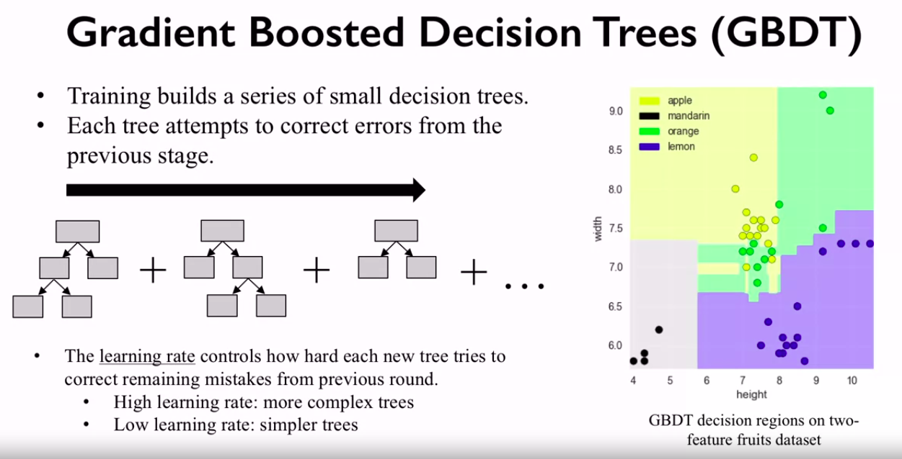  
        - Does not require normaliztion
        - does not recommend for text classification and other problems with very high dimensional sparse features.
        - **GBDT Parameters**
            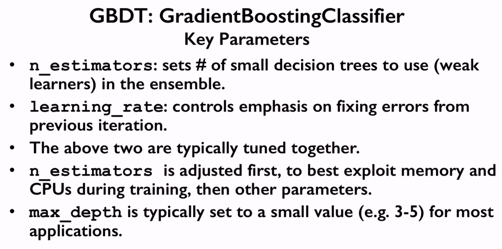 
                  
   - **Neural Networks**
        - **Multi-Layer Preceptron (MLP)**    
            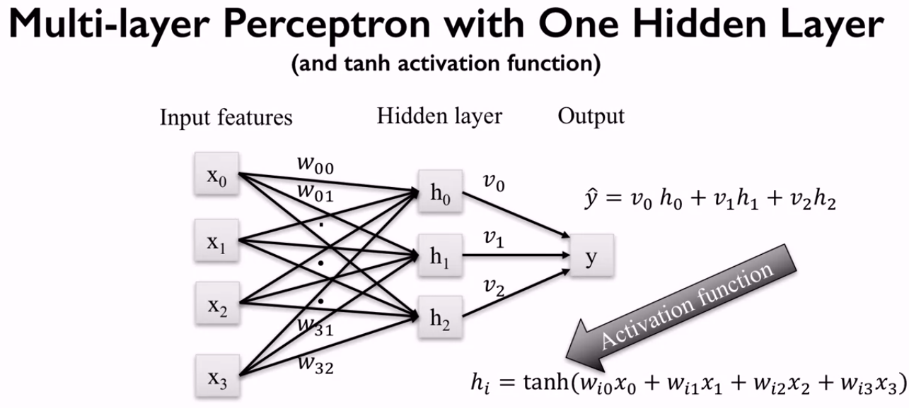 
            
            - **Activation Functions** 
                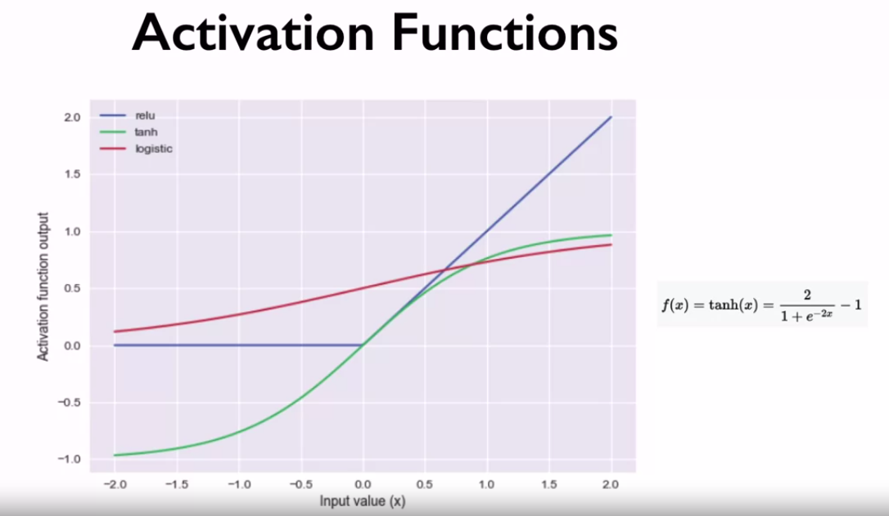   
           
            - **MLP Parameters**   
                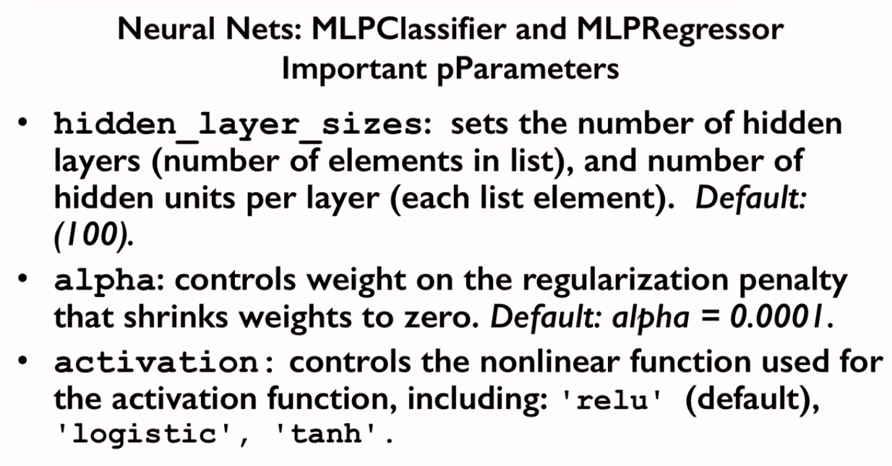 
                - Solver parameter
                  - It specify the algorithm that learns the network weights
                  - **Adam**
                      - It tends to be efficient and effective on large data set with thousands of training instances
                  - **lbfgs**
                      - It tends to be faster and find more effective weights for small data set.        
              
   - **Data Leakage**
        - When the data use are using to train contains information about what you are trying to predict.
        - Introducing information about the traget during training. 
        
        - **Data Leakage Types** 
            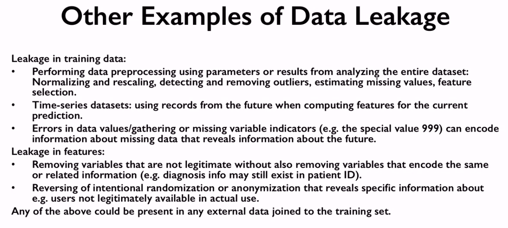 
         
        - **Detect Data Leakage** 
            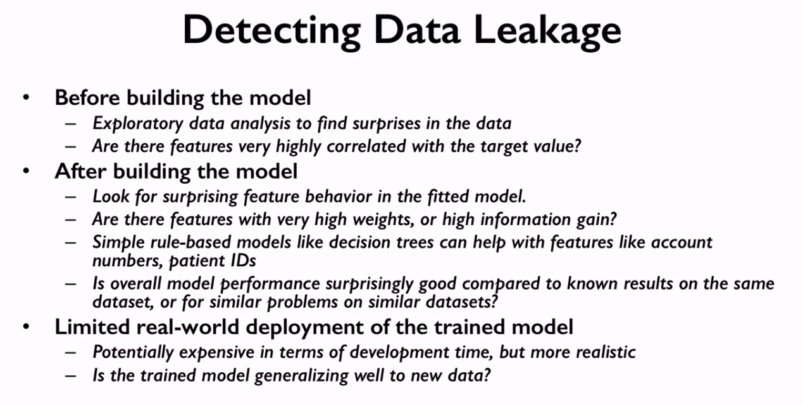    
        
        - **Minimizing Data Leakage** 
            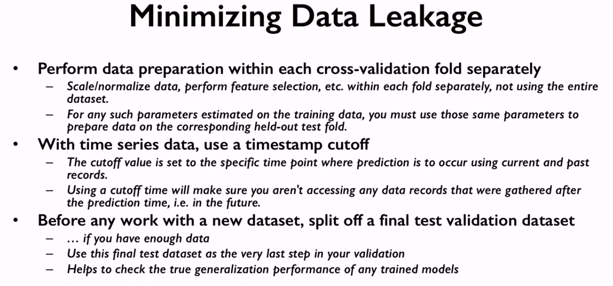                    

# 2- What’s new for you ?

   - Gradient Boosted Decision Trees
   - Data Leakage

# 3- Resources ? 

   - https://www.kite.com/python/docs/sklearn.naive_bayes.GaussianNB.partial_fit
   - https://machinelearningmastery.com/naive-bayes-for-machine-learning/#:~:text=Naive%20Bayes%20is%20a%20classification,binary%20or%20categorical%20input%20values.
   - https://scikit-learn.org/stable/modules/generated/sklearn.naive_bayes.GaussianNB.html
   - https://www.datacamp.com/community/tutorials/random-forests-classifier-python
   - https://machinelearningmastery.com/random-forest-ensemble-in-python/
   - https://builtin.com/data-science/random-forest-algorithm
   - https://machinelearningmastery.com/gentle-introduction-gradient-boosting-algorithm-machine-learning/
   - https://towardsdatascience.com/machine-learning-part-18-boosting-algorithms-gradient-boosting-in-python-ef5ae6965be4
   - https://techcrunch.com/2017/04/13/neural-networks-made-easy/
   - http://playground.tensorflow.org/
   - https://developer.nvidia.com/blog/deep-learning-nutshell-core-concepts/
   - https://ai.googleblog.com/2017/03/assisting-pathologists-in-detecting.html
   - https://medium.com/@colin.fraser/the-treachery-of-leakage-56a2d7c4e931
   - https://www.cs.umb.edu/~ding/history/470_670_fall_2011/papers/cs670_Tran_PreferredPaper_LeakingInDataMining.pdf
   - https://www.kaggle.com/c/the-icml-2013-whale-challenge-right-whale-redux/discussion/4865#25839#post25839
   - http://martin.zinkevich.org/rules_of_ml/rules_of_ml.pdf
