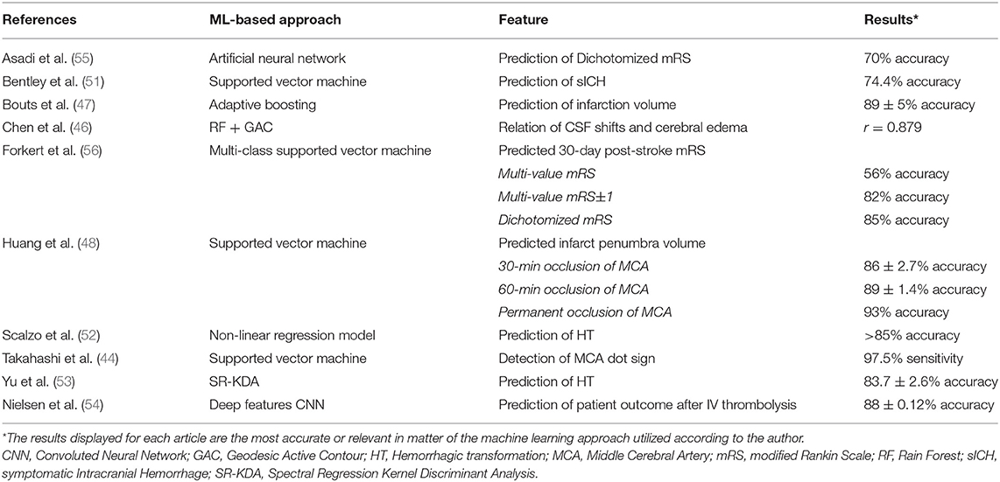
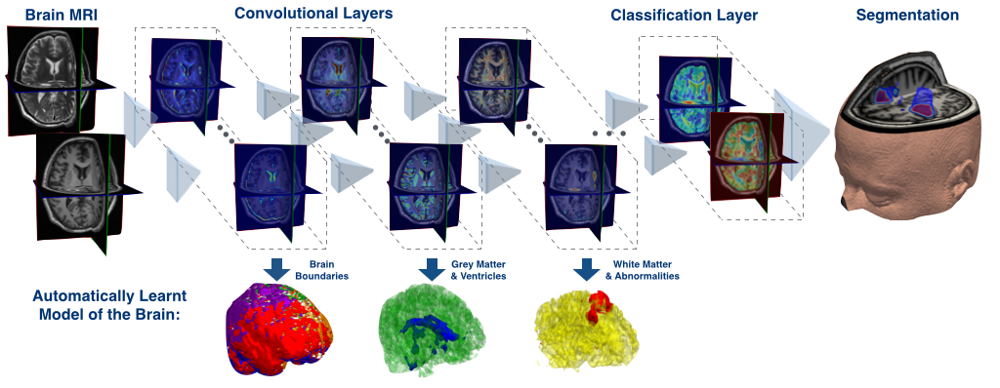
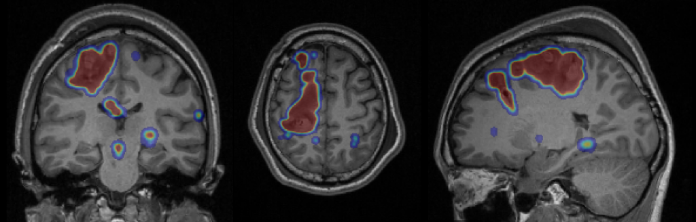
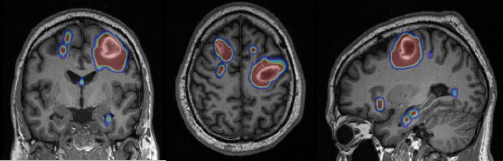

# Search about AI to classify Stroke or not.

## Explain Everything here:-

   - **Stroke** according to the WHO:-
        - 15 million people suffer stroke worldwide each year.
        -  Of these, 5 million die and another 5 million are permanently disabled.

   - Machine learning algorithms have been used to assist in the diagnosis and individualized treatment decisions in acute ischemic stroke.

   - The machine learning applications are numerous:-
        - Early identification of imaging diagnostic findings.     
        - Estimating time of onset
        - Lesion segmentation
        - Fate of salvageable tissue 
        - The analysis of cerebral edema 
        - Predicting complicationsand patient outcomes after treatment.

       - Use of machine learning in stroke diagnosis and outcome prognosis. 
       

### AI Applications and Algorithms in stroke
 
   1. **Fully automatic acute ischemic lesion segmentation in DWI using convolutional neural networks**
        by Liang Chen, Paul Bentley, and Daniel Rueckert
        - using a framework with two CNNs to segment stroke lesions using DWI in MRI.
        - One CNN was a combination of two DeconvNets (EDD Net)
        - and the second CNN was a multi-scale convolutional label evaluation net (MUSCLE Net)
          - to help reduce the potential false positives detected by the EDD Net.
        - The dataset was built with clinical acquired DWI from 741 subjects, exhibiting a high lesion detection rate, and accuracy.
        - A mean accuracy of Dice coefficient obtained is **0.67 in total**.
        - The mean Dice scores based on subjects with only small and large lesions are 0.61 and 0.83, respectively.
        - The lesion detection rate achieved is **0.94**.

      - The red circles indicate the acute ischemic lesions and the yellow ones show the artefacts.
       
       

   2. **DeepMedic**
        - is a software for brain lesion segmentation
          - based on a multi-scale 3D Deep CNN coupled with a 3D fully connected Conditional Random Field.
          - The system has been shown to yield excellent performance lesion segmentation tasks
            - including traumatic brain injuries, brain tumors, and ischemic stroke lesions.
       
       - The DeepMedic Architecture:-    
       
       - DeepMedic Segmentation
       
       

   - **Current Challenges and Future Directions in Machine Learning for Acute Ischemic Stroke**
        - The first limitation is that of sample size
          - A big dataset in AIS for public use does not currently exist.   
        - The second limitation is the need for labeling regions of interest or “gold standard” findings on the images. 

## Put your resources here:-

  - https://www.frontiersin.org/articles/10.3389/fneur.2018.00945/full
  - https://github.com/deepmedic/deepmedic
  - https://www.sciencedirect.com/science/article/pii/S221315821730147X?via%3Dihub
  - https://www.sciencedaily.com/releases/2020/03/200330152137.htm
  - https://www.ahajournals.org/doi/10.1161/STROKEAHA.119.027611
  - https://www.ncbi.nlm.nih.gov/pmc/articles/PMC5977679/
