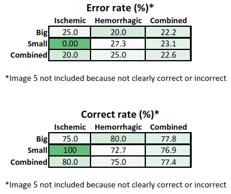

# Search about AI to classify Hemorrhagic & Ischemic Stroke.

# Explain Everything here:-

   - **Ischemic strokes**
        - It happens when an artery in the brain gets blocked, usually by a blood clot preventing blood from reaching a part of the brain. 
        - blood carries oxygen and nutrients to the cells, without these the brain cells die. 
        - It's the most common type of stroke, occurring in 87% of cases.  
  
   - **Hemorrhagic strokes**
        - It happens when a blood artery in the brain bursts, causing blood to spill out into the brain. 
        - This can be caused by high blood pressure and/or weak arteries.

   - It is important to know the difference between these types of strokes.
        - The wrong treatment for either could lead to a worse prognosis.
        - Artificial intelligence (AI) could help with this.
        - Ischemic and hemorrhagic strokes can be distinguished by magnetic resonance imaging (MRI) or computerised tomography (CT) scans. 

            

            - Appearance of Ischemic and hemorrhagic strokes on CT scan. 
            - An ischemic stroke appears dark compared to the rest of the brain. 
            - While a hemorrhagic stroke appears bright, the blood that spills into the brain appears brighter than the rest of the brain 
            - In both cases above, the stroke appears on the left side of the brain. 

        - In this field, a study is performed to:-
          - inverstigate whether AI can determine the difference between the two types of strokes based on CT scan pictures.
          - The images used in the study were organised into ischemic and hemorrhagic stroke by splitting them into separate folders.
          - These folders were then each split into **big** and **small** based on the size of the stroke.
          - The small strokes were less than approximately **20%** of a brain.
          - The big strokes were larger than this approximate cut off.
          - These four sets were then divided into training and validation sets.
          - The training set was **90%** of the images.
          - The validation set was **10%** of the images.
          - The training and validation sets of each stroke were visually compared to make sure that they looked similar.
          - In the final training set, there were:-
            - 127 images:-
              - 56 images of ischemic stroke (45 large and 11 small) 
              - 71 images of hemorrhagic stroke (39 large and 32 small)
          - In the final validation set there were:-
            - 41 images:-
              - 20 images of ischemic stroke (18 large and 2 small) 
              - 21 images of hemorrhagic stroke (10 large and 11 small)
          - This study is performed by Google Teachable Machine

           

            - stroke classification from the validation set of images.
            - The top two examples were correctly identified, and the bottom example was incorrectly identified. 

           

            - The error rate and correct rate of the trained AI program. On average, AI was correct 77.4% of the time.

# Put your resources here:-

   - https://www.ncbi.nlm.nih.gov/pmc/articles/PMC6236025/
   - https://personalpages.manchester.ac.uk/staff/fumie.costen/pastwork/DATA/readingmaterial/strokeAI2.pdf
   - https://ysjournal.com/can-artificial-intelligence-tell-the-difference-between-ischemic-and-hemorrhagic-stroke/
   - https://ieeexplore.ieee.org/document/8473057
   - https://onlinelibrary.wiley.com/doi/full/10.1046/j.1365-2796.2002.01013.x
   - https://www.hindawi.com/journals/bn/2015/891651/
   - https://journals.plos.org/plosone/article/file?id=10.1371/journal.pone.0178636&type=printable
