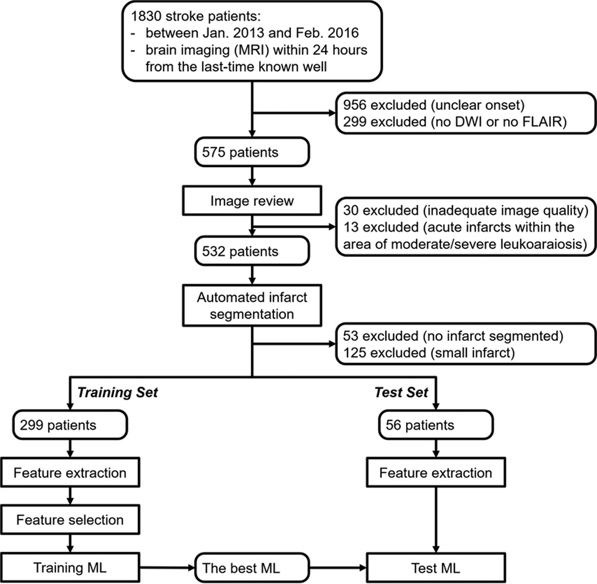
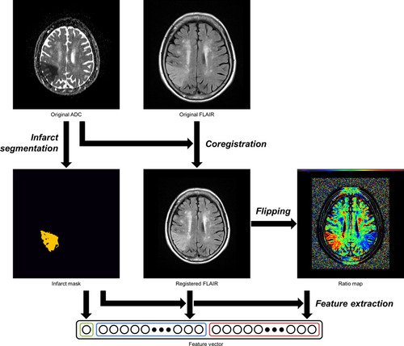
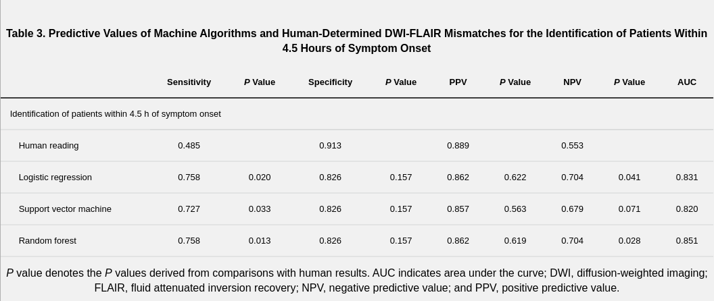

# Search about AI to Know about the Time of this stroke.

   1. 1:6 Hours
   2. 1st 24 Hours
   3. 2nd 24 Hours

# Explain Everything here

   - The prescribed moment to perform thrombolysis is within 3 to 4.5 hours after the onset of stroke
   - Stroke symptoms are not noticed by the patient.
        - However, up to **25%** of stroke patients are reported to have been sleeping during the onset of a stroke.
        - reportes said that most events of stroke occur between **6 AM and noon**, suggesting that people waking up in the morning with stroke symptoms are likely to have a **TSS of less than a few hours**.
   - Five MRI sequences to help you determine time of stroke onset with AI 
        1. Using the Diffusion-weighted imaging **DWI MRI**:- 
           - **DWI MRI** is capable of detecting signal intensity changes in the stroke-affected area of the brain within minutes of the onset.

        2. Using **Spectroscopy**:-
           - Spectroscopy analyses the chemical spectrum of the investigated brain cells.
           - a significant accumulation of lactate can be observed in the affected ischemic brain cells, after twenty-four hours from TSS.

        3. Using **T2-weighted sequences**:-
           - In case of a large stroke, flow voids can be seen in the large arteries.
           -  the changes in signal intensity (increased signal) can only be observed 8 hours after the start of the ischemic changes
           
        4. Using **T1-weighted sequences**:-
           - T1 signal intensity changes (decreased signal) only 16 hours after TSS.
           - they prove even less useful than T2-weighted sequences.

        5. The most likely candidate for **TSS determination** is the combination of **fluid-attenuated inversion recovery sequence (FLAIR)** and the **DWI sequence**.
        
   - Study population and process.
        - an application of artificial intelligence was developed
          - Use multiple imaging features including those even invisible to humans with a consistent accuracy
          - ML methods may be helpful in determining the timing of acute stroke.
          
          
          - **Image Processing**:-
              - image features were extracted from 2 modified FLAIR images:
                1. FLAIR registered on the ADC map.
                2. FLAIR ratio map reflected around the midsagittal plane.
              

          - **Three ML algorithms were used**:
              - Logistic regression (LR)
              - Support vector machine (SVM)
              - Random forest (RF)    
          
          - **Feature Selection using Univariate Analysis**:-
              - Total of 34 vector features from images were significantly different between the groups who underwent MRI within and after 4.5 hours of symptom onset and were selected for the generation of ML models.

          - **Identification of Patients With Stroke Within 4.5 Hours of Symptom Onset**
              
              - **RF model** showed the highest area under the curve for identifying the time window.
              - patients within 4.5 hours of symptom onset were identified with a **sensitivity of 0.48** and a **specificity of 0.91**. 
              - All ML algorithms showed significantly higher sensitivities than human visual assessment in detecting onset times. 

          - This study showed that an automated system developed using ML methods can be useful in identifying the tissue age of patients with acute stroke assessed **within 4.5 hours** of symptom onset. 

   
# Put your resources here

   - https://www.quantib.com/blog/how-can-ai-help-determine-time-of-ischemic-stroke-onset
   - https://www.ahajournals.org/doi/10.1161/STROKEAHA.119.027611
   - https://en.wikipedia.org/wiki/Diffusion_MRI#:~:text=Diffusion%2Dweighted%20magnetic%20resonance%20imaging,generate%20contrast%20in%20MR%20images.
   - https://github.com/HyunnaLee/StrokeOnset
   - https://labs.dgsom.ucla.edu/arnold/files/papers/HoTMI2019.pdf
