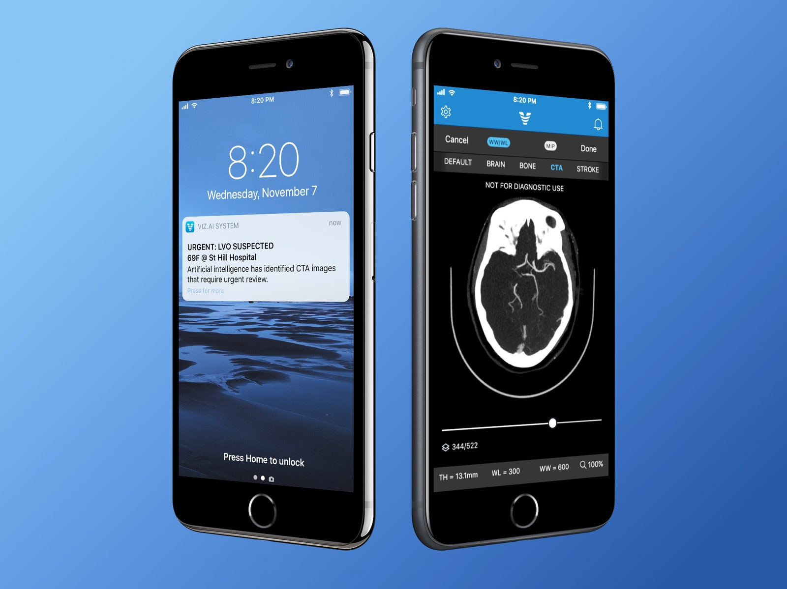

# Search about AI to Know brain tissue affected.

# Explain Everything here

   - AI to Help Stroke Victims When **Time Is Brain**
        - **A Complete Solution from Automated Detection to Timely Treatment**. 
        - Doctors sum up the importance of each successive minute with a pithy and chilling phrase:
          - **Time is brain**: The longer a person waits for treatment, the more brain tissue dies.
          - **Time is brain**: but also disability, or death.
        - **Viz.ai** is the first complete platform to help in that race against time by automatically analyzing CT scans of ER patients.
            - The company has trained machine-learning algorithms to detect blockages in major brain blood vessels.
            - When the software thinks it has found a blockage
              1. It Suggest the most common form of stroke.
              2. It sends an alert to a brain specialist’s smartphone asking them to review the images. 
              3. The software also flags the specific images it judges to be most important.
            - **Images from Viz's app that can alert a specialist that a patient's brain shows evidence of stroke**.  
            
              

   - **RAPID software**
        - This software takes the image results from the perfusion imaging scans.
        - Within a couple of minutes, produces a map that indicates what is dead in pink and what is salvageable in green.   
        - a small dead area and a large salvageable area – could be successfully treated up to 24 hours.

          

# Put your resources here

   - https://www.wired.com/story/using-ai-to-help-stroke-victims-when-time-is-brain/
   - https://www.viz.ai/
   - https://www.biotechniques.com/neuroscience/advances-in-ai-and-neuroimaging-combine-to-slay-stroke/
   - https://www.rapidai.com/
   - https://www.youtube.com/channel/UC4KBnsVQpEwGkZWZcZBEU1A
