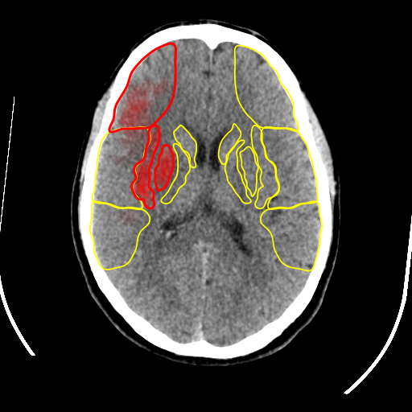

# Search about AI to Know vessels affected.

# Explain Everything here

   - **Viz.ai uses AI and Deep Learning to detect source of Stroke** 
        - When it comes to dealing with a patient that has suffered a stroke, speed is often more important than healthcare.
        - The idea of being able to detect a blocked artery, clot, or rupture that bars blood flow to the brain in minutes, rather than hours, could mean the difference between patient disability and walking out of the hospital.
        - This can give a stroke patient the chance to receive treatment sooner and save them from long term brain damage, disability, and paralysis.
        - A stroke occurs when blood supply to the brain is suddenly interrupted. 
        - **Viz.ai** uses AI and deep learning to analyze CT scans.
            - The technology automatically detects early signs of large vessel occlusion (LVO) strokes and alerts physicians. 
            - The company has trained machine-learning algorithms to detect blockages in major brain blood vessels.
            - When the software thinks it has found a blockage
              1. It Suggest the most common form of stroke.
              2. It sends an alert to a brain specialist’s smartphone asking them to review the images. 
              3. The software also flags the specific images it judges to be most important.
            - **Ischemic stroke CT of brain show cerebral infarction at left frontal**.  
            

            - **Viz.ai algorithm**
                - Said at the time of the clearance the applications' median scan to notification time was less than **six minutes**.
                - In more than **95% of cases**, it said the software was faster than a specialist in deciding to notify a provider of suspected risk, saving **52 minutes** on average.

   - **A systematic review of AI in acute LVO stroke identification and triage**
        - Large vessel occlusions (LVOs) requires detection and treatment
        - Using ML methods of **random forest learning (RFL)** and **convolutional neural networks (CNNs)** to detect LVO strokes.
        -  LVO detection typically used CNNs.
           - Image feature detection had greater sensitivity with CNN than with RFL, 85% versus 68%. 

   - **Their are three current software platforms incorporate ML to detect stroke and vessels affected**
        1. Brainomix (greatest validation of AI for ASPECTS, uses CNNs to automatically detect LVOs)

           - **e-CTA**
               - Fast, consistent identification of large vessel occlusion (LVO) and collateral assessments powered by AI and big data, based on CTA analysis.
               - e-CTA is ground-breaking CTA image processing software that uses advanced algorithms, artificial intelligence (AI) and large data analytics to automate the detection of LVO locations and standardize the collateral assessment process.

                  

           - **e-ASPECTS**
               - AI-enabled support for fast and consistent interpretation of non-contrast CTs.
               - It helps to solve this issue by using artificial intelligence (AI) to enable quick and accurate assessment of ischemic stroke damage, both by quantifying the volume of ischemia.

                     
  
        2. **iSchemaView - rapidai** (largest number of perfusion study validations for thrombectomy)

        3. **Viz.ai** (uses CNNs to automatically detect LVOs, then automatically activates emergency stroke treatment systems). 

# Put your resources here

   - https://nocamels.com/2020/08/israel-viz-ai-stroke-detection/
   - https://www.youtube.com/watch?time_continue=45&v=XOTe2FlwZ8M&feature=emb_logo
   - https://www.viz.ai/
   - https://www.medtechdive.com/news/medtronic-to-distribute-ai-stroke-detection-and-triage-software/559206/
   - https://brainomix.com/e-stroke-suite
   - https://www.unboundmedicine.com/medline/citation/31594798/Artificial_intelligence_to_diagnose_ischemic_stroke_and_identify_large_vessel_occlusions:_a_systematic_review_
