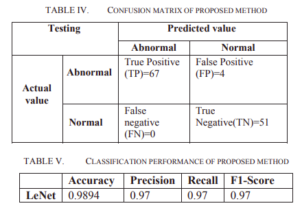
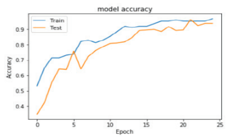

# Search about different papers to classify (Normal-Abnormal) and present the result of this papers.

   1. **Brain Stroke Detection Using Convolutional Neural Network and Deep Learning Models**
        - **Date**
            - 2019
            
        - **The Dataset**  
            - (ATLAS) Dataset
              - The dataset contained 229 T1-weighted MRI images suffered from stroke. 210 abnormal images and 210 normal images. 
               - Then labelled normal patient images as 0 and abnormal patient images as 1 for classification. 
                  
                
        - **Used Machine Learning Algorithms**  
            - LeNet (convolutional neural network) model
        
        - **Accuracy**  
                
             
            
               
        - **Conclusion** 
            - The research experimental results show that these deep neural networks are absolutely relevant to brain stroke diagnosis.
            - Therefore, the accuracy got on proposed method is better than traditional machine learning methods.

                
# Put your resources here 
 
   - https://link.springer.com/article/10.1007/s00521-019-04041-y
   - https://www.frontiersin.org/articles/10.3389/fneur.2018.00945/full
   - https://link.springer.com/article/10.1007/s11760-017-1182-8
   - https://ieeexplore.ieee.org/document/8969052
   - https://ieeexplore.ieee.org/document/9234472
   - https://sci-hub.do/downloads/2020-05-30/66/gaidhani2019.pdf?rand=5fa019c325906?download=true
   - https://dacemirror.sci-hub.do/proceedings-article/fad09891412b11adf75c6b439eb0f1ab/barman2019.pdf?rand=5fa0195e50131?download=true
   - https://sci-hub.do/https://ieeexplore.ieee.org/document/7833355#

