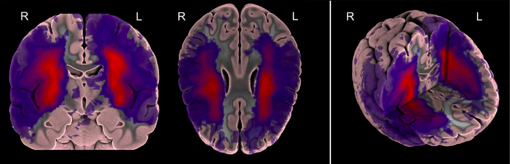
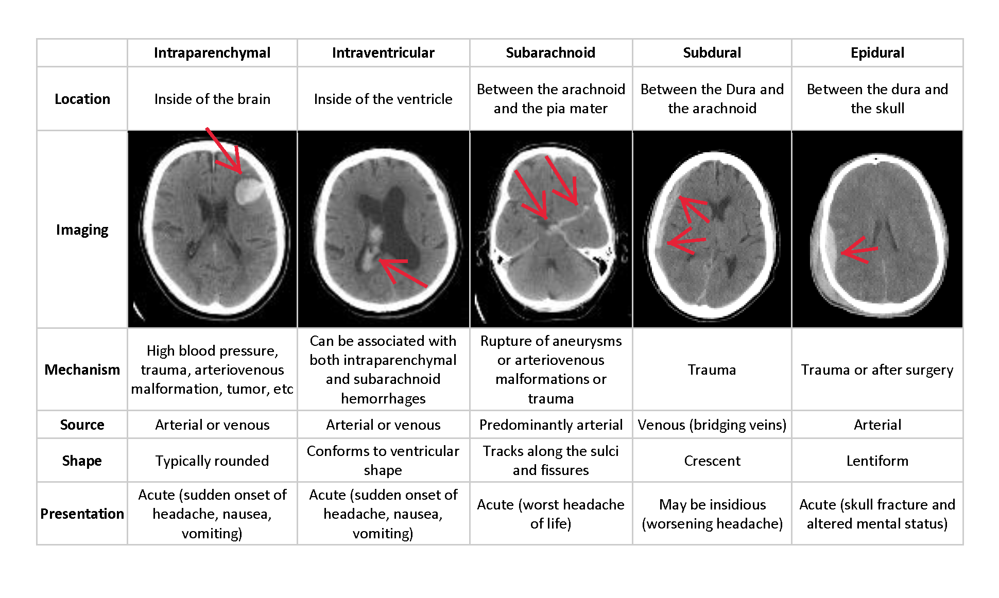
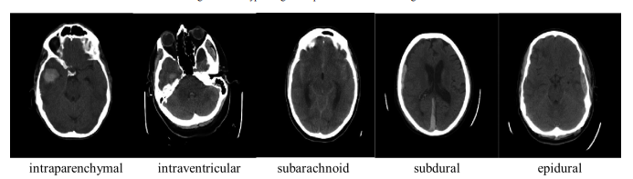

# Search about the  different  DataSets to classify between types of Hemorrhagic and Ischemic Stroke

   - **The Anatomical Tracings of Lesions After Stroke (ATLAS) Dataset** 
        - A large, open source dataset of stroke anatomical brain images and manual lesion segmentations
        - is an open-source data collection consisting a total of 304 T1-weighted MRIs (Magnetic Resonance Imaging) with manually segmented diverse lesions and metadata. 
        - From 11 cohorts worldwide, 304 MRI images were collected from research groups in the ENIGMA Stroke Recovery Working Group consortium.
        - Images consisted of T1-weighted anatomical MRIs of individuals after stroke.  
         
            
        
        
   - **RSNA Intracranial Hemorrhage Detection**
        - RSNA dataset provided by the Radiological Society of North America (RSNA®) in collaboration with members of the American Society of Neuroradiology and MD.ai.
        - All provided images are in DICOM format.
          - DICOM images contain associated metadata. 
          - This will include PatientID, StudyInstanceUID, SeriesInstanceUID, and other features.  
          - Predict whether a hemorrhage exists in a given image, and what type it is      
            
           
           
            
# Put your resources here 

   - https://www.kaggle.com/felipekitamura/head-ct-hemorrhage
   - https://medpix.nlm.nih.gov/search?allen=true&allt=true&alli=true&query=stroke
   - https://medpix.nlm.nih.gov/search?allen=true&allt=true&alli=true&query=Hemorrhagic%20stroke
   - https://ieee-dataport.org/open-access/automatic-segmentation-stroke-lesions-non-contrast-computed-tomography-datasets#files
   - https://www.icpsr.umich.edu/web/ICPSR/studies/36684/datadocumentation
   - http://fcon_1000.projects.nitrc.org/indi/retro/atlas_download.html
   - https://github.com/npnl/ATLAS 
   - https://www.researchgate.net/publication/323299707_A_large_open_source_dataset_of_stroke_anatomical_brain_images_and_manual_lesion_segmentations
   - https://www.kaggle.com/c/rsna-intracranial-hemorrhage-detection/data
   - https://academictorrents.com/details/5bdb401695ad36d4ccd73da90c2f9f8ab6f82092
   - https://www.biorxiv.org/content/10.1101/179614v1.full
   - https://sci-hub.do/downloads/2020-09-07/5b/10.1109@EMBC44109.2020.9176162.pdf?rand=5fa0313e28d74?download=true
   - http://www.isles-challenge.org/
     

