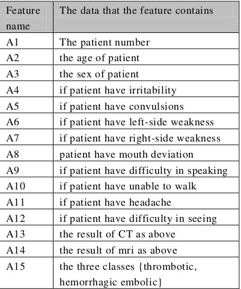
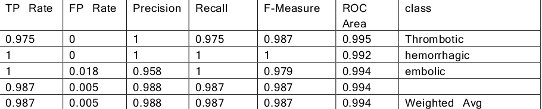
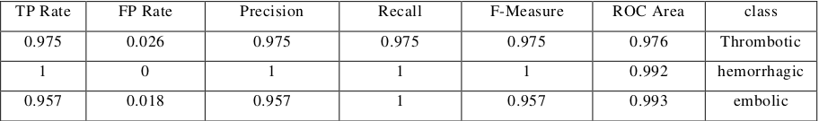
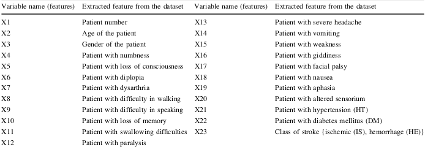
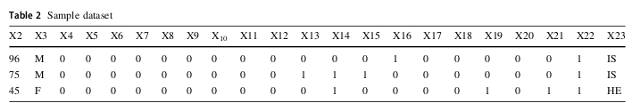
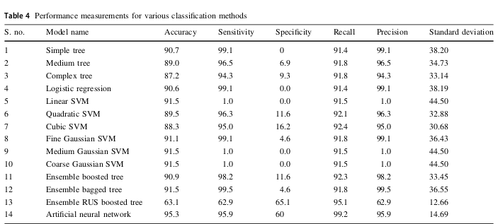

# Search about different papers to classify (Normal-Abnormal) and present the result of this papers.

   1. **Classification of Ischemic Stroke using Machine Learning Algorithms**
        - **Date**
            - 2016
            
        - **The Dataset**  
            - The dataset items were collected from several hospitals and medical centers in Sudan.   
            - The hospitalreport includes the patient number, age, sex, CT, MRI diagnoses, and other variables for all patients hospitalized in the hospitals participated in the study. 
            - The data used in the dataset include the data of patient of cases from 2013 to 2015.
            - The dataset contains 400 patients; their age is mainly between 50 and 88 years. A few cases in the age of 33 years and most of them are male. 
               
              
        - **Used Machine Learning Algorithms**  
            - k- Nearest Neighbor Algorithm 
            - Decision Trees Algorithm
        
        - **Accuracy** 
            1. Decision Trees Algorithm 
                 
            
            2. k- Nearest Neighbor Algorithm 
                   
               
        - **Conclusion** 
            - The results of the experiment revealed that the performance of decision tree classification is better than the performance of KNN algorithm.
            
   2. **Classification of stroke disease using machine learning algorithms**
         - **Date**
            - 2019
            
        - **The Dataset**  
            - The data were collected in the form of patient case sheets from Sugam Multispecialty Hospital, India.
            - The case sheets contained information from over 507 stroke patients ranging from 35 to 90 years of age.
            - A total of 22 unique class labels related to stroke were identified that fell under two major stroke types: ischemic stroke and hemorrhagic stroke.  
               
               
              
        - **Used Machine Learning Algorithms**  
            - Artificial Neural Network **ANN** 
            - Decision Trees Algorithm
            - Support Vector Machine **SVM**
            - Logistic Regression **LR**
            - Bagging and boosting
        
        - **Accuracy** 
               
               
        - **Conclusion** 
            - The categories of SVM and ensemble (bagged) provided 91% accuracy with 0.0000 negative predictive value.
            - ANN trained with the stochastic gradient descent algorithm outperformed other algorithms, with a higher classification accuracy [ 95% with a lower standard deviation of 14.69.
            - This study indicates that stroke is more prevalent in men than in women and in the age group from 40 to 60 years old.               
                
# Put your resources here 
 
   - https://link.springer.com/article/10.1007/s00521-019-04041-y
   - https://www.frontiersin.org/articles/10.3389/fneur.2018.00945/full

